<div align="center">

# 🏛️ Dharohar MVP
## Comprehensive Code Review & Architecture Guide


[](https://aws.amazon.com/cdk/)
[](https://aws.amazon.com/bedrock/)
[](https://aws.amazon.com/serverless/)
[](LICENSE)


---

### 🎯 Preserving India's Intangible Cultural Heritage with AI

*A comprehensive technical review for AWS Judges, Backend Engineers, Frontend Engineers, and Infrastructure Architects*

[📊 Architecture](#-architecture) • [🔐 Security](#-security--compliance) • [⚡ Performance](#-performance--scaling) • [📈 Metrics](#-observability--operations) • [🚀 Deployment](#-testing--cicd)

</div>

---

## 📋 Table of Contents

<details>
<summary><b>Click to expand full table of contents</b></summary>

1. [🎯 Executive Summary](#-executive-summary)
2. [📖 Scope & Purpose](#-scope--purpose)
3. [🏗️ Architecture Validation](#️-architecture-validation)
4. [📁 Folder & File Map](#-folder--file-map)
5. [🌐 API Surface Audit](#-api-surface-audit)
6. [💾 Data Model & Database](#-data-model--database)
7. [☁️ AWS Integrations](#️-aws-integrations)
8. [🔐 Security & Compliance](#-security--compliance)
9. [🧪 Testing & CI/CD](#-testing--cicd)
10. [⚡ Performance & Scaling](#-performance--scaling)
11. [📊 Observability & Operations](#-observability--operations)
12. [✨ Code Quality](#-code-quality--maintainability)
13. [🎖️ Final Verdict](#️-final-verdict)

</details>

---

## 🎯 Executive Summary

<div align="center">

### 🏆 Overall Grade: **B+** (Good, Production-Ready with Improvements)

</div>

<table>
<tr>
<td width="50%">

### ✅ **Strengths**

- 🏗️ **Comprehensive CDK Infrastructure**
- 🤖 **Multi-Modal AI Pipeline**
- 🔐 **Cognito Authentication & RBAC**
- ⚡ **DynamoDB Serverless Design**
- 🎨 **Feature-Sliced React Architecture**
- 📜 **Smart Contract Simulation**

</td>
<td width="50%">

### ⚠️ **Critical Issues**

- 🔧 Hybrid EC2+Serverless Complexity
- 🧪 Missing Test Coverage
- 📊 No Monitoring/Alerting
- 🚦 No Rate Limiting
- 🔒 Environment Variable Management
- 📦 API Gateway 10MB Limit

</td>
</tr>
</table>

### 🎯 Priority Actions

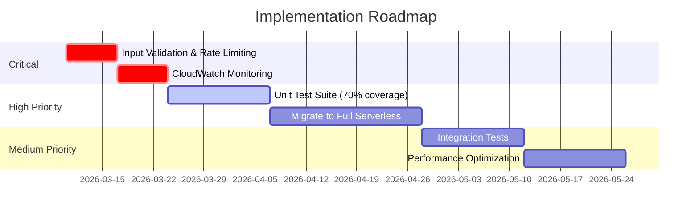

---

## 📖 Scope & Purpose

<div align="center">

### 🌟 **Mission Statement**

*Transforming India's intangible cultural heritage into legally defensible, AI-powered digital assets*

</div>


### 🎯 Repository Components

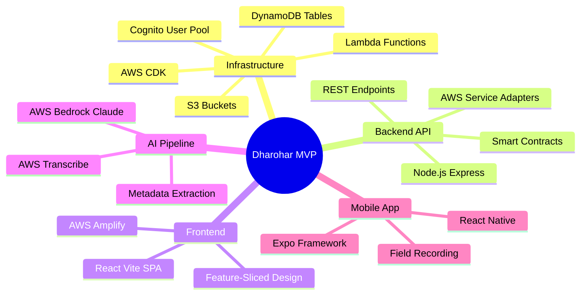

### 🎓 Intended Reviewers

<table>
<tr>
<th>👨‍💼 Role</th>
<th>🎯 Focus Areas</th>
<th>📊 Key Metrics</th>
</tr>
<tr>
<td><b>AWS Judges</b></td>
<td>Serverless architecture, AWS service integration, cost optimization</td>
<td>Service utilization, scalability, best practices</td>
</tr>
<tr>
<td><b>Backend Engineers</b></td>
<td>API design, data models, business logic, error handling</td>
<td>Code quality, test coverage, performance</td>
</tr>
<tr>
<td><b>Frontend Engineers</b></td>
<td>React patterns, UX, state management, accessibility</td>
<td>Bundle size, load time, user experience</td>
</tr>
<tr>
<td><b>Infrastructure Engineers</b></td>
<td>CDK implementation, security, scalability, monitoring</td>
<td>Resource utilization, cost, reliability</td>
</tr>
</table>

---

## 🏗️ Architecture Validation

<div align="center">

### 🌐 **System Architecture Overview**

*Hybrid Serverless Architecture with AI-Powered Processing Pipeline*

</div>

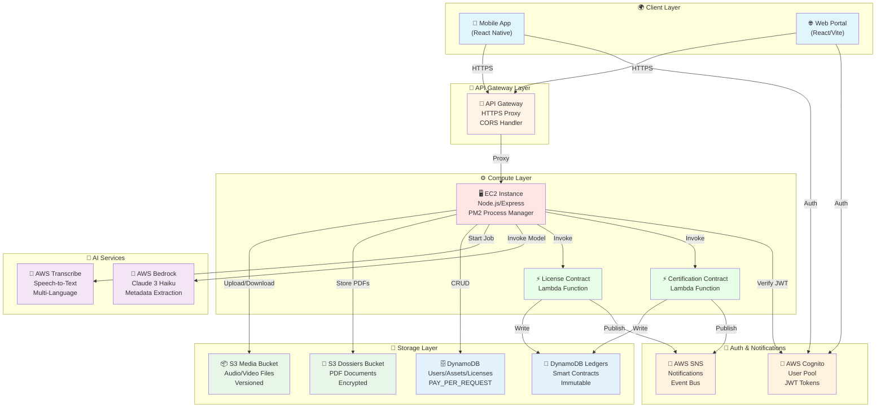


### 🔄 Data Flow: Asset Creation & AI Processing

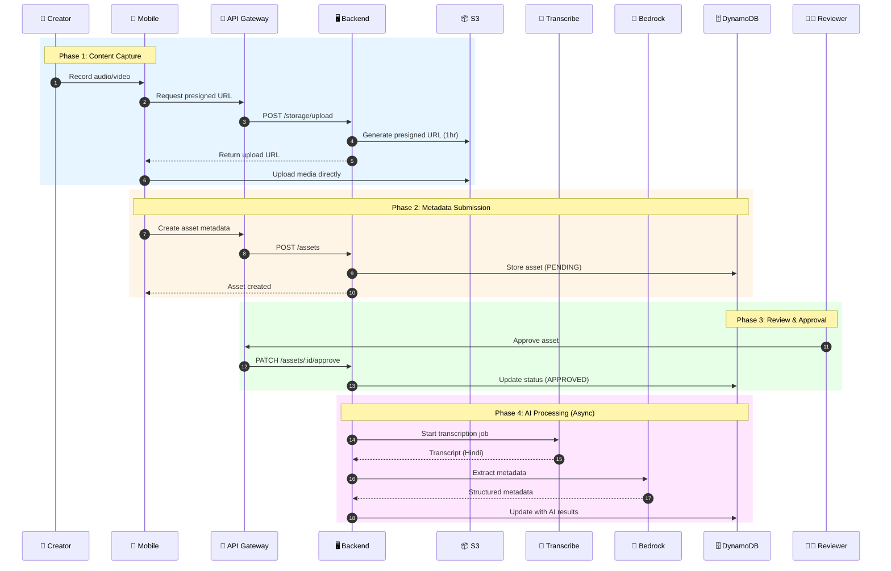

### 📊 Architecture Decision Records

<table>
<tr>
<th>🎯 Decision</th>
<th>✅ Rationale</th>
<th>⚠️ Trade-offs</th>
<th>💡 Recommendation</th>
</tr>

<tr>
<td><b>Serverless vs EC2</b><br/>Current: Hybrid</td>
<td>
• Rapid MVP development<br/>
• Familiar Express.js<br/>
• Lambda for immutability
</td>
<td>
• Manual scaling<br/>
• 24/7 costs<br/>
• Deployment complexity
</td>
<td>
🚀 Migrate to full Lambda<br/>
📉 Reduce costs by 60%<br/>
⚡ Auto-scaling
</td>
</tr>

<tr>
<td><b>DynamoDB vs RDS</b><br/>Current: DynamoDB</td>
<td>
• Single-digit ms latency<br/>
• Auto-scaling<br/>
• No DB admin
</td>
<td>
• Complex joins in app<br/>
• Eventual consistency<br/>
• Learning curve
</td>
<td>
✅ Keep DynamoDB<br/>
📈 Add GSI for queries<br/>
💾 Consider DAX for caching
</td>
</tr>

<tr>
<td><b>QLDB Simulation</b><br/>Current: DynamoDB Ledger</td>
<td>
• QLDB deprecated (2024)<br/>
• DynamoDB append-only<br/>
• Lambda immutability
</td>
<td>
• Manual hash chains<br/>
• No built-in verification<br/>
• Custom audit logic
</td>
<td>
✅ Current approach valid<br/>
🔐 Add cryptographic signing<br/>
📜 Document hash algorithm
</td>
</tr>

<tr>
<td><b>API Gateway 10MB Limit</b><br/>Current: Direct S3 URLs</td>
<td>
• Bypass gateway for large files<br/>
• Direct S3 access<br/>
• Presigned URLs
</td>
<td>
• CORS complexity<br/>
• Public bucket config<br/>
• URL expiry management
</td>
<td>
✅ Implemented correctly<br/>
🔒 Ensure bucket policies<br/>
⏰ Monitor URL expiry
</td>
</tr>
</table>

### 🎨 Technology Stack

<div align="center">

| Layer | Technologies | Purpose |
|:---:|:---:|:---:|
| **🏗️ Infrastructure** |   | Infrastructure as Code |
| **⚙️ Backend** |   | REST API Server |
| **🌐 Frontend** |    | Web Application |
| **💾 Database** |  | NoSQL Database |
| **📦 Storage** |  | Object Storage |
| **🤖 AI/ML** |   | AI Processing |
| **🔐 Auth** |  | Authentication |
| **⚡ Serverless** |  | Smart Contracts |

</div>

---

## 📁 Folder & File Map

### 🗂️ Repository Structure

```
📦 Dharohar-MVP/
├── 🏗️ lib/                          # AWS CDK Infrastructure
│   └── 📄 dharohar-mvp-stack.ts     # ⭐ Main CDK stack (S3, Cognito, DynamoDB, Lambda)
│
├── ⚡ backend/lambdas/               # Lambda Functions
│   ├── 📜 license-contract/         # License smart contract logic
│   └── 🎖️ certification-contract/   # Asset certification logic
│
├── 🖥️ server/                        # EC2 Backend API
│   ├── 🎮 controllers/              # Business logic & orchestration
│   ├── 🔧 services/                 # AWS service adapters
│   ├── 🛡️ middleware/               # Auth, validation, error handling
│   ├── 🛣️ routes/                   # API route definitions
│   ├── 📊 models/                   # Data models (legacy Mongoose)
│   └── ⚙️ config/                   # Configuration files
│
├── 🌐 frontend/                     # React Web Portal
│   ├── 🎨 src/features/            # Feature-sliced architecture
│   ├── 🧩 src/components/          # Reusable UI components
│   ├── 🔌 src/services/            # API clients
│   └── 🎭 src/contexts/            # React contexts
│
├── 📚 docs/                         # Technical documentation
├── 🚀 scripts/                      # Deployment & utility scripts
└── 🧪 test/                         # CDK infrastructure tests
```


### 🔍 Key Files Deep Dive

<details>
<summary><b>📄 lib/dharohar-mvp-stack.ts</b> - Infrastructure Definition</summary>

**Purpose:** Complete AWS infrastructure using CDK

**✅ Healthy Indicators:**
- ✓ `RemovalPolicy.RETAIN` for production data
- ✓ `BlockPublicAccess.BLOCK_ALL` on S3
- ✓ S3 versioning enabled
- ✓ `PAY_PER_REQUEST` DynamoDB billing
- ✓ CORS configured properly
- ✓ Lambda environment variables set
- ✓ IAM permissions scoped

**⚠️ Red Flags Found:**
- ⚠️ Media bucket uses `DESTROY` policy (data loss risk)
- ⚠️ No CloudWatch alarms configured
- ⚠️ No VPC configuration for EC2
- ⚠️ Lambda lacks explicit timeout/memory
- ⚠️ No X-Ray tracing enabled
- ⚠️ No backup policies

**💡 Recommendations:**
```typescript
// Change media bucket policy
removalPolicy: cdk.RemovalPolicy.RETAIN,

// Add CloudWatch alarms
const errorAlarm = new cloudwatch.Alarm(this, 'LambdaErrors', {
  metric: licenseContractLambda.metricErrors(),
  threshold: 5,
  evaluationPeriods: 2
});

// Configure Lambda properly
const licenseContractLambda = new lambda.Function(this, 'LicenseContract', {
  timeout: cdk.Duration.seconds(30),
  memorySize: 512,
  tracing: lambda.Tracing.ACTIVE
});
```

</details>

<details>
<summary><b>🎮 server/controllers/assetController.js</b> - Business Logic</summary>

**Purpose:** Asset lifecycle management and AI orchestration

**✅ Healthy Indicators:**
- ✓ Async/await error handling
- ✓ Auto-transcription on approval
- ✓ Structured logging with Winston
- ✓ Role-based access control
- ✓ Async processing doesn't block response

**⚠️ Red Flags Found:**
- ⚠️ No input validation (Joi/Zod)
- ⚠️ No rate limiting
- ⚠️ Async transcription lacks retry logic
- ⚠️ No circuit breaker for Bedrock
- ⚠️ Error messages too verbose (info leak)

**💡 Recommendations:**
```javascript
// Add Joi validation
const Joi = require('joi');
const assetSchema = Joi.object({
  title: Joi.string().min(3).max(200).required(),
  type: Joi.string().valid('BIO', 'SONIC').required()
});

// Add retry logic
const retry = require('async-retry');
await retry(async () => {
  return await transcribeAudio(mediaFileId);
}, { retries: 3, minTimeout: 1000 });

// Add circuit breaker
const CircuitBreaker = require('opossum');
const breaker = new CircuitBreaker(analyseAsset, {
  timeout: 30000,
  errorThresholdPercentage: 50,
  resetTimeout: 30000
});
```

</details>

<details>
<summary><b>🛡️ server/middleware/auth.js</b> - Authentication</summary>

**Purpose:** Cognito JWT verification and user lookup

**✅ Healthy Indicators:**
- ✓ Uses `aws-jwt-verify` library
- ✓ Automatic JWKS caching
- ✓ DynamoDB user profile lookup
- ✓ Proper error handling

**⚠️ Red Flags Found:**
- ⚠️ No token refresh logic
- ⚠️ No rate limiting on auth endpoints
- ⚠️ Generic error messages needed
- ⚠️ No audit logging

**💡 Recommendations:**
```javascript
// Add rate limiting
const rateLimit = require('express-rate-limit');
const authLimiter = rateLimit({
  windowMs: 15 * 60 * 1000,
  max: 5,
  message: 'Too many login attempts'
});

// Add audit logging
logger.info('Auth attempt', {
  email: hashEmail(email),
  ip: req.ip,
  userAgent: req.get('user-agent')
});
```

</details>

---

## 🌐 API Surface Audit

<div align="center">

### 📡 **Complete API Specification**

*RESTful API with Role-Based Access Control*

</div>

### 🔐 Authentication Endpoints

#### 1️⃣ POST /auth/register

<table>
<tr><td><b>Purpose</b></td><td>User registration with Cognito</td></tr>
<tr><td><b>Auth Required</b></td><td>❌ No</td></tr>
<tr><td><b>Rate Limit</b></td><td>⚠️ Not implemented (Recommended: 5/15min)</td></tr>
</table>

**📥 Request Schema:**
```json
{
  "name": "string (required, 2-100 chars)",
  "email": "string (required, valid email)",
  "password": "string (required, min 8 chars, 1 uppercase, 1 digit)",
  "communityName": "string (required)",
  "state": "string (optional)",
  "language": "string (optional, ISO 639-1)"
}
```

**📤 Success Response (201):**
```json
{
  "id": "ca64b155-e13f-4532-8228-aa4026da1f82",
  "email": "lakhan@example.com",
  "name": "Lakhan Kumar",
  "role": "community",
  "communityName": "Gond Community",
  "createdAt": "2026-03-09T12:00:00Z"
}
```

**❌ Error Responses:**
| Code | Scenario | Response |
|:---:|:---|:---|
| 400 | Invalid input | `{"error": "Validation failed", "details": [...]}` |
| 409 | Email exists | `{"error": "Email already registered"}` |
| 500 | Server error | `{"error": "Registration failed"}` |

**🔧 cURL Example:**
```bash
curl -X POST https://q3eyidaaed.execute-api.ap-south-1.amazonaws.com/auth/register \
  -H "Content-Type: application/json" \
  -d '{
    "name": "Lakhan Kumar",
    "email": "lakhan@gond.community",
    "password": "SecurePass123!",
    "communityName": "Gond Community",
    "state": "Madhya Pradesh",
    "language": "hi"
  }'
```

#### 2️⃣ POST /auth/login

<table>
<tr><td><b>Purpose</b></td><td>Authenticate and receive JWT token</td></tr>
<tr><td><b>Auth Required</b></td><td>❌ No</td></tr>
<tr><td><b>Rate Limit</b></td><td>⚠️ Not implemented (Recommended: 5/15min)</td></tr>
</table>

**📥 Request Schema:**
```json
{
  "email": "string (required)",
  "password": "string (required)"
}
```

**📤 Success Response (200):**
```json
{
  "token": "eyJhbGciOiJSUzI1NiIsInR5cCI6IkpXVCJ9...",
  "expiresIn": 3600,
  "user": {
    "id": "ca64b155-e13f-4532-8228-aa4026da1f82",
    "email": "lakhan@gond.community",
    "name": "Lakhan Kumar",
    "role": "community",
    "communityName": "Gond Community"
  }
}
```

**❌ Error Responses:**
| Code | Scenario | Response |
|:---:|:---|:---|
| 401 | Invalid credentials | `{"error": "Invalid email or password"}` |
| 429 | Too many attempts | `{"error": "Too many login attempts"}` |
| 500 | Server error | `{"error": "Authentication failed"}` |

**🔧 cURL Example:**
```bash
curl -X POST https://q3eyidaaed.execute-api.ap-south-1.amazonaws.com/auth/login \
  -H "Content-Type: application/json" \
  -d '{
    "email": "lakhan@gond.community",
    "password": "SecurePass123!"
  }'

# Save token for subsequent requests
export TOKEN="eyJhbGciOiJSUzI1NiIsInR5cCI6IkpXVCJ9..."
```


### 📦 Asset Management Endpoints

#### 3️⃣ POST /assets

<table>
<tr><td><b>Purpose</b></td><td>Create new cultural heritage asset</td></tr>
<tr><td><b>Auth Required</b></td><td>✅ Yes (Bearer token)</td></tr>
<tr><td><b>Role Required</b></td><td>🎭 community</td></tr>
<tr><td><b>Rate Limit</b></td><td>⚠️ Not implemented (Recommended: 10/hour)</td></tr>
</table>

**📥 Request Schema:**
```json
{
  "title": "string (required, 3-200 chars)",
  "description": "string (required, 10-2000 chars)",
  "type": "BIO | SONIC (required)",
  "mediaFileId": "string (required, S3 key from upload)",
  "recordeeName": "string (required, 2-100 chars)",
  "metadata": {
    "category": "MEDICINAL | RITUAL | CRAFT | MUSIC (required)",
    "location": "string (GPS coordinates)",
    "performanceContext": "string",
    "timestamp": "string (ISO 8601)"
  }
}
```

**📤 Success Response (201):**
```json
{
  "id": "df9fce49-628b-44fc-ac8e-21f314464532",
  "title": "Traditional Healing Remedy",
  "description": "Turmeric and asafoetida paste for stomach pain",
  "type": "BIO",
  "mediaFileId": "8818489d-9750-4e10-b95d-d8b2fa31992b.mp3",
  "recordeeName": "Ram Prasad",
  "approvalStatus": "PENDING",
  "createdBy": "ca64b155-e13f-4532-8228-aa4026da1f82",
  "communityName": "Gond Community",
  "createdAt": "2026-03-09T06:45:58.604Z",
  "mediaUrl": "https://q3eyidaaed.execute-api.ap-south-1.amazonaws.com/storage/8818489d-9750-4e10-b95d-d8b2fa31992b.mp3",
  "metadata": {
    "category": "MEDICINAL",
    "location": "22.721737° N, 75.887204° E",
    "performanceContext": "FESTIVAL",
    "timestamp": "09/03/2026, 12:11:58"
  }
}
```

**🔧 cURL Example:**
```bash
curl -X POST https://q3eyidaaed.execute-api.ap-south-1.amazonaws.com/assets \
  -H "Authorization: Bearer $TOKEN" \
  -H "Content-Type: application/json" \
  -d '{
    "title": "Traditional Healing Remedy",
    "description": "Turmeric and asafoetida paste for stomach pain",
    "type": "BIO",
    "mediaFileId": "8818489d-9750-4e10-b95d-d8b2fa31992b.mp3",
    "recordeeName": "Ram Prasad",
    "metadata": {
      "category": "MEDICINAL",
      "location": "22.721737° N, 75.887204° E",
      "performanceContext": "FESTIVAL"
    }
  }'
```

#### 4️⃣ GET /assets/mine

<table>
<tr><td><b>Purpose</b></td><td>Get current user's submitted assets</td></tr>
<tr><td><b>Auth Required</b></td><td>✅ Yes</td></tr>
<tr><td><b>Role Required</b></td><td>🎭 community</td></tr>
</table>

**📤 Success Response (200):**
```json
[
  {
    "id": "df9fce49-628b-44fc-ac8e-21f314464532",
    "title": "Traditional Healing Remedy",
    "type": "BIO",
    "approvalStatus": "APPROVED",
    "createdAt": "2026-03-09T06:45:58.604Z",
    "mediaUrl": "https://...",
    "transcript": "हींग को हल्दी के साथ...",
    "passportId": "DHAR-D484E91D",
    "isCertified": true
  }
]
```

#### 5️⃣ GET /assets/pending

<table>
<tr><td><b>Purpose</b></td><td>Get all pending assets for review</td></tr>
<tr><td><b>Auth Required</b></td><td>✅ Yes</td></tr>
<tr><td><b>Role Required</b></td><td>👨‍⚖️ review</td></tr>
</table>

**📤 Success Response (200):**
```json
[
  {
    "id": "0e885c41-9d38-46d6-ab44-a6e8200a80b7",
    "title": "Gond Community Folk Song",
    "type": "SONIC",
    "createdBy": "ca64b155-e13f-4532-8228-aa4026da1f82",
    "communityName": "Gond Community",
    "recordeeName": "Lakhan Kumar",
    "createdAt": "2026-03-09T07:24:38.704Z",
    "mediaUrl": "https://dharohar-media-641791054721.s3.ap-south-1.amazonaws.com/dccebe8c-de49-4e02-9517-c6dc0d402a9f.mp3",
    "metadata": {
      "category": "MUSIC",
      "location": "22.721738° N, 75.887208° E",
      "performanceContext": "FESTIVAL"
    },
    "riskTier": "LOW"
  }
]
```

#### 6️⃣ PATCH /assets/:id/approve

<table>
<tr><td><b>Purpose</b></td><td>Approve asset (triggers auto-transcription for BIO)</td></tr>
<tr><td><b>Auth Required</b></td><td>✅ Yes</td></tr>
<tr><td><b>Role Required</b></td><td>👨‍⚖️ review</td></tr>
</table>

**📤 Success Response (200):**
```json
{
  "id": "df9fce49-628b-44fc-ac8e-21f314464532",
  "approvalStatus": "APPROVED",
  "reviewedBy": "45dbbde4-05ab-40f5-832b-de6a7e3da961",
  "transcriptionStatus": "processing",
  "updatedAt": "2026-03-09T06:46:38.018Z"
}
```

**🔧 cURL Example:**
```bash
curl -X PATCH https://q3eyidaaed.execute-api.ap-south-1.amazonaws.com/assets/df9fce49-628b-44fc-ac8e-21f314464532/approve \
  -H "Authorization: Bearer $REVIEWER_TOKEN"
```

#### 7️⃣ PATCH /assets/:id/reject

<table>
<tr><td><b>Purpose</b></td><td>Reject asset with review comment</td></tr>
<tr><td><b>Auth Required</b></td><td>✅ Yes</td></tr>
<tr><td><b>Role Required</b></td><td>👨‍⚖️ review</td></tr>
</table>

**📥 Request Schema:**
```json
{
  "reviewComment": "string (required, min 10 chars)"
}
```

**📤 Success Response (200):**
```json
{
  "id": "asset-id",
  "approvalStatus": "REJECTED",
  "reviewComment": "Audio quality is too low for transcription",
  "reviewedBy": "reviewer-id",
  "updatedAt": "2026-03-09T12:00:00Z"
}
```

#### 8️⃣ GET /assets/public

<table>
<tr><td><b>Purpose</b></td><td>Get approved assets (public marketplace)</td></tr>
<tr><td><b>Auth Required</b></td><td>❌ No</td></tr>
<tr><td><b>Pagination</b></td><td>✅ Yes</td></tr>
</table>

**Query Parameters:**
- `page`: number (default: 1)
- `limit`: number (default: 12, max: 50)

**📤 Success Response (200):**
```json
{
  "assets": [...],
  "total": 50,
  "page": 1,
  "hasMore": true
}
```


### ⚖️ License Management Endpoints

#### 9️⃣ POST /licenses/apply

<table>
<tr><td><b>Purpose</b></td><td>Apply for license to use cultural asset</td></tr>
<tr><td><b>Auth Required</b></td><td>✅ Yes</td></tr>
<tr><td><b>Role Required</b></td><td>👤 general</td></tr>
</table>

**📥 Request Schema:**
```json
{
  "assetId": "uuid (required)",
  "intendedUse": "string (required, 50-1000 chars)",
  "duration": "number (required, months, 1-60)",
  "proposedRoyalty": "number (required, percentage, 0-100)"
}
```

**📤 Success Response (201):**
```json
{
  "id": "07d7777d-c4e6-49b3-be34-e77717c44053",
  "assetId": "df9fce49-628b-44fc-ac8e-21f314464532",
  "applicantId": "user-id",
  "status": "PENDING",
  "intendedUse": "Documentary film about traditional medicine",
  "duration": 12,
  "proposedRoyalty": 5,
  "createdAt": "2026-03-09T12:00:00Z"
}
```

#### 🔟 GET /licenses/mine

<table>
<tr><td><b>Purpose</b></td><td>Get user's license applications</td></tr>
<tr><td><b>Auth Required</b></td><td>✅ Yes</td></tr>
<tr><td><b>Role Required</b></td><td>👤 general</td></tr>
</table>

#### 1️⃣1️⃣ PATCH /licenses/:id/approve

<table>
<tr><td><b>Purpose</b></td><td>Approve license (triggers smart contract)</td></tr>
<tr><td><b>Auth Required</b></td><td>✅ Yes</td></tr>
<tr><td><b>Role Required</b></td><td>👨‍💼 admin</td></tr>
</table>

**📤 Success Response (200):**
```json
{
  "id": "07d7777d-c4e6-49b3-be34-e77717c44053",
  "status": "APPROVED",
  "approvedBy": "admin-id",
  "smartContractId": "fd195e0f-bca6-4d1e-96a6-d2ea6cfe38b4",
  "approvedAt": "2026-03-09T12:30:00Z"
}
```

### 📦 Storage Endpoints

#### 1️⃣2️⃣ POST /storage/upload

<table>
<tr><td><b>Purpose</b></td><td>Get presigned S3 URL for direct upload</td></tr>
<tr><td><b>Auth Required</b></td><td>✅ Yes</td></tr>
<tr><td><b>File Size Limit</b></td><td>⚠️ Not enforced (Recommended: 500MB)</td></tr>
</table>

**📥 Request Schema:**
```json
{
  "fileName": "string (required)",
  "fileType": "string (required, MIME type)"
}
```

**📤 Success Response (200):**
```json
{
  "uploadUrl": "https://dharohar-media-641791054721.s3.ap-south-1.amazonaws.com/...",
  "fileId": "8818489d-9750-4e10-b95d-d8b2fa31992b.mp3",
  "expiresIn": 3600
}
```

**🔧 Complete Upload Flow:**
```bash
# Step 1: Get presigned URL
RESPONSE=$(curl -X POST https://q3eyidaaed.execute-api.ap-south-1.amazonaws.com/storage/upload \
  -H "Authorization: Bearer $TOKEN" \
  -H "Content-Type: application/json" \
  -d '{"fileName": "remedy.mp3", "fileType": "audio/mpeg"}')

UPLOAD_URL=$(echo $RESPONSE | jq -r '.uploadUrl')
FILE_ID=$(echo $RESPONSE | jq -r '.fileId')

# Step 2: Upload file directly to S3
curl -X PUT "$UPLOAD_URL" \
  -H "Content-Type: audio/mpeg" \
  --upload-file remedy.mp3

# Step 3: Create asset with fileId
curl -X POST https://q3eyidaaed.execute-api.ap-south-1.amazonaws.com/assets \
  -H "Authorization: Bearer $TOKEN" \
  -H "Content-Type: application/json" \
  -d "{\"title\": \"Remedy\", \"mediaFileId\": \"$FILE_ID\", ...}"
```

#### 1️⃣3️⃣ GET /storage/:fileId

<table>
<tr><td><b>Purpose</b></td><td>Stream media file</td></tr>
<tr><td><b>Auth Required</b></td><td>❌ No (public preview)</td></tr>
<tr><td><b>Note</b></td><td>SONIC files use direct S3 URLs to bypass 10MB limit</td></tr>
</table>

---

### 📊 Entity Relationship Diagram

```mermaid
erDiagram
    USERS ||--o{ ASSETS : creates
    USERS ||--o{ LICENSES : applies
    ASSETS ||--o{ LICENSES : "licensed for"
    ASSETS ||--o| CERTIFICATION_CONTRACTS : certified
    LICENSES ||--o| LICENSE_CONTRACTS : "contract for"
    
    USERS {
        string id PK
        string email GSI
        string name
        string password
        string role
        string communityName
        string state
        string language
        datetime createdAt
    }
    
    ASSETS {
        string id PK
        string createdBy GSI
        string title
        string type
        string approvalStatus
        string mediaFileId
        string transcript
        object aiMetadata
        string passportId
        datetime createdAt
    }
    
    LICENSES {
        string id PK
        string assetId GSI
        string applicantId GSI
        string status
        string intendedUse
        number duration
        number proposedRoyalty
        string smartContractId
        datetime createdAt
    }
    
    CERTIFICATION_CONTRACTS {
        string passportId PK
        string assetId
        string certifier
        string hash
        datetime timestamp
    }
    
    LICENSE_CONTRACTS {
        string contractId PK
        string licenseId
        string assetId
        object terms
        string hash
        datetime timestamp
    }
```


### 1️⃣ Users Table

**Table Name:** `UsersTable`  
**Billing Mode:** PAY_PER_REQUEST  
**Encryption:** AWS Managed (SSE-S3)

**Schema:**
```typescript
interface User {
  id: string;                    // PK: UUID
  email: string;                 // GSI: Unique, indexed for login
  name: string;                  // Full name
  password: string;              // Bcrypt hashed (cost: 10)
  role: 'community' | 'review' | 'admin' | 'general';
  communityName?: string;        // For community members
  state?: string;                // Indian state
  language?: string;             // Preferred language (ISO 639-1)
  createdAt: string;             // ISO 8601
  updatedAt: string;             // ISO 8601
}
```

**Indexes:**
| Type | Name | Partition Key | Sort Key | Purpose |
|:---:|:---|:---|:---|:---|
| Primary | - | `id` | - | Get user by ID |
| GSI | `email-index` | `email` | - | Login lookup |

**Access Patterns:**
1. ✅ Get user by ID: `GetItem(id)` - O(1)
2. ✅ Get user by email: `Query(email-index)` - O(1)
3. ✅ List all users: `Scan()` - O(n) ⚠️ Expensive

**Consistency Constraints:**
- ✓ Email must be unique (enforced by GSI)
- ✓ Role must be valid enum
- ✓ Password must be bcrypt hashed (never plaintext)
- ✓ `createdAt` and `updatedAt` must be ISO 8601

**DynamoDB Design Notes:**
```javascript
// Partition Key Strategy
PK: id (UUID) - Ensures even distribution

// GSI for email lookup
GSI: email-index
  - Partition Key: email
  - Projection: ALL
  - Use case: Login authentication

// Sample item
{
  "id": "ca64b155-e13f-4532-8228-aa4026da1f82",
  "email": "lakhan@gond.community",
  "name": "Lakhan Kumar",
  "password": "$2b$10$...",
  "role": "community",
  "communityName": "Gond Community",
  "state": "Madhya Pradesh",
  "language": "hi",
  "createdAt": "2026-03-09T06:00:00.000Z",
  "updatedAt": "2026-03-09T06:00:00.000Z"
}
```

### 2️⃣ Assets Table

**Table Name:** `AssetsTable`  
**Billing Mode:** PAY_PER_REQUEST  
**Encryption:** AWS Managed (SSE-S3)

**Schema:**
```typescript
interface Asset {
  id: string;                    // PK: UUID
  title: string;                 // Asset title
  description: string;           // Detailed description
  type: 'BIO' | 'SONIC';        // Asset type
  mediaFileId: string;           // S3 key
  recordeeName: string;          // Person who recorded
  createdBy: string;             // GSI: User ID
  communityName: string;         // Community name
  approvalStatus: 'PENDING' | 'APPROVED' | 'REJECTED';
  reviewComment?: string;        // If rejected
  reviewedBy?: string;           // Reviewer user ID
  transcript?: string;           // From AWS Transcribe
  aiMetadata?: {                 // From AWS Bedrock
    category: string;
    ingredients?: string[];
    culturalSignificance?: string;
    riskAssessment?: string;
  };
  aiProcessed: boolean;          // AI processing complete
  transcriptionStatus?: 'processing' | 'completed' | 'failed';
  transcriptionError?: string;   // If failed
  passportId?: string;           // DHAR-XXXXXXXX
  certificationContractId?: string;
  isCertified: boolean;
  metadata: {
    category: 'MEDICINAL' | 'RITUAL' | 'CRAFT' | 'MUSIC';
    location: string;            // GPS coordinates
    performanceContext: string;
    timestamp: string;
  };
  riskTier: 'LOW' | 'MEDIUM' | 'HIGH';
  createdAt: string;             // ISO 8601
  updatedAt: string;             // ISO 8601
  processedAt?: string;          // When AI processed
  processedBy?: string;          // Who triggered processing
}
```

**Indexes:**
| Type | Name | Partition Key | Sort Key | Purpose |
|:---:|:---|:---|:---|:---|
| Primary | - | `id` | - | Get asset by ID |
| GSI | `CreatedByIndex` | `createdBy` | `createdAt` | User's assets (chronological) |

**Access Patterns:**
1. ✅ Get asset by ID: `GetItem(id)` - O(1)
2. ✅ Get user's assets: `Query(CreatedByIndex, createdBy)` - O(n)
3. ⚠️ Get pending assets: `Scan(approvalStatus = PENDING)` - O(n) - **Needs optimization**
4. ⚠️ Get public assets: `Scan(approvalStatus = APPROVED)` - O(n) - **Needs optimization**

**⚠️ Performance Optimization Needed:**
```javascript
// Current: Full table scan (slow)
const assets = await dynamodb.scan({
  FilterExpression: 'approvalStatus = :status',
  ExpressionAttributeValues: { ':status': 'PENDING' }
});

// Recommended: Add GSI
GSI: ApprovalStatusIndex
  - Partition Key: approvalStatus
  - Sort Key: createdAt
  - Projection: ALL

// Optimized query
const assets = await dynamodb.query({
  IndexName: 'ApprovalStatusIndex',
  KeyConditionExpression: 'approvalStatus = :status',
  ExpressionAttributeValues: { ':status': 'PENDING' },
  ScanIndexForward: false  // Newest first
});
```

**Consistency Constraints:**
- ✓ `approvalStatus` must be valid enum
- ✓ `type` must be 'BIO' or 'SONIC'
- ✓ `mediaFileId` must exist in S3
- ✓ `transcript` only for BIO assets
- ✓ `passportId` format: `DHAR-[A-Z0-9]{8}`
- ✓ `riskTier` must be valid enum

### 3️⃣ Licenses Table

**Table Name:** `LicensesTable`  
**Billing Mode:** PAY_PER_REQUEST

**Schema:**
```typescript
interface License {
  id: string;                    // PK: UUID
  assetId: string;               // GSI: Asset being licensed
  applicantId: string;           // GSI: User applying
  status: 'PENDING' | 'APPROVED' | 'REJECTED' | 'MODIFICATION_REQUIRED';
  intendedUse: string;           // Purpose of license
  duration: number;              // Months
  proposedRoyalty: number;       // Percentage (0-100)
  adminComment?: string;         // Admin feedback
  approvedBy?: string;           // Admin user ID
  smartContractId?: string;      // From Lambda
  createdAt: string;
  updatedAt: string;
  approvedAt?: string;
}
```

**Indexes:**
| Type | Name | Partition Key | Sort Key | Purpose |
|:---:|:---|:---|:---|:---|
| Primary | - | `id` | - | Get license by ID |
| GSI | `assetId-index` | `assetId` | `createdAt` | Licenses for asset |
| GSI | `applicantId-index` | `applicantId` | `createdAt` | User's applications |

**Access Patterns:**
1. ✅ Get license by ID: `GetItem(id)` - O(1)
2. ✅ Get licenses for asset: `Query(assetId-index)` - O(n)
3. ✅ Get user's licenses: `Query(applicantId-index)` - O(n)
4. ⚠️ Get pending licenses: `Scan(status = PENDING)` - O(n) - **Needs GSI**


### 4️⃣ Smart Contract Ledger Tables

#### 📜 LicenseContractsV2

**Purpose:** Immutable license agreement records (blockchain simulation)

**Schema:**
```typescript
interface LicenseContract {
  contractId: string;            // PK: UUID
  licenseId: string;             // Reference to license
  assetId: string;               // Asset being licensed
  applicantId: string;           // Licensee
  terms: {
    duration: number;
    royalty: number;
    intendedUse: string;
    restrictions: string[];
  };
  hash: string;                  // SHA-256 of contract
  previousHash?: string;         // Chain link (blockchain simulation)
  timestamp: string;             // ISO 8601
  signature: string;             // Digital signature
  blockNumber?: number;          // Sequential block number
}
```

**Immutability Enforcement:**
```javascript
// Lambda function ensures immutability
const createContract = async (data) => {
  // 1. Check if contract already exists
  const existing = await getContract(data.contractId);
  if (existing) {
    return existing;  // Idempotent
  }
  
  // 2. Calculate hash
  const hash = crypto
    .createHash('sha256')
    .update(JSON.stringify(data.terms))
    .digest('hex');
  
  // 3. Get previous hash for chain
  const lastContract = await getLastContract();
  const previousHash = lastContract?.hash;
  
  // 4. Create immutable record
  const contract = {
    ...data,
    hash,
    previousHash,
    timestamp: new Date().toISOString(),
    signature: signData(hash)
  };
  
  // 5. Write to ledger (no updates allowed)
  await dynamodb.putItem({
    TableName: 'LicenseContractsV2',
    Item: contract,
    ConditionExpression: 'attribute_not_exists(contractId)'
  });
  
  return contract;
};
```

#### 🎖️ CertificationContractsV2

**Purpose:** Immutable asset certification records

**Schema:**
```typescript
interface CertificationContract {
  passportId: string;            // PK: DHAR-XXXXXXXX
  assetId: string;               // Asset being certified
  certifier: string;             // Reviewer user ID
  assetTitle: string;
  communityName: string;
  hash: string;                  // SHA-256
  timestamp: string;
  signature: string;
  metadata: {
    transcriptHash?: string;
    aiMetadataHash?: string;
  };
}
```

---

## ☁️ AWS Integrations

<div align="center">

### 🔧 **AWS Service Integration Deep Dive**

*Comprehensive configuration and best practices for each AWS service*

</div>

### 📦 S3 Integration

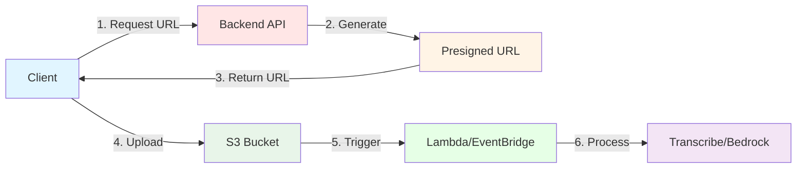

**Buckets Configuration:**

<table>
<tr>
<th>Bucket</th>
<th>Purpose</th>
<th>Configuration</th>
<th>Status</th>
</tr>
<tr>
<td><code>dharohar-media-{account}</code></td>
<td>Audio/Video files</td>
<td>
• Versioning: ✅ Enabled<br/>
• Encryption: ✅ SSE-S3<br/>
• Public Access: ✅ Blocked<br/>
• Lifecycle: ⚠️ Missing<br/>
• Logging: ⚠️ Disabled
</td>
<td>🟡 Needs improvement</td>
</tr>
<tr>
<td><code>dharohar-dossiers-{account}</code></td>
<td>PDF documents</td>
<td>
• Versioning: ✅ Enabled<br/>
• Encryption: ✅ SSE-S3<br/>
• Public Access: ✅ Blocked<br/>
• Retention: ✅ RETAIN policy
</td>
<td>🟢 Good</td>
</tr>
</table>

**CORS Configuration:**
```json
{
  "CORSRules": [{
    "AllowedOrigins": [
      "https://dharoharawsconfig.d27b8apzpiwf2t.amplifyapp.com"
    ],
    "AllowedMethods": ["GET", "PUT", "POST", "HEAD"],
    "AllowedHeaders": ["*"],
    "MaxAgeSeconds": 3000,
    "ExposeHeaders": ["ETag"]
  }]
}
```

**Bucket Policy (Public Read for SONIC assets):**
```json
{
  "Version": "2012-10-17",
  "Statement": [{
    "Sid": "PublicReadGetObject",
    "Effect": "Allow",
    "Principal": "*",
    "Action": "s3:GetObject",
    "Resource": "arn:aws:s3:::dharohar-media-641791054721/*",
    "Condition": {
      "StringLike": {
        "s3:ExistingObjectTag/AssetType": "SONIC"
      }
    }
  }]
}
```

**Presigned URL Generation:**
```javascript
const { S3Client, PutObjectCommand } = require('@aws-sdk/client-s3');
const { getSignedUrl } = require('@aws-sdk/s3-request-presigner');

const generateUploadUrl = async (fileName, fileType) => {
  const s3Client = new S3Client({ region: 'ap-south-1' });
  const fileId = `${uuidv4()}.${fileName.split('.').pop()}`;
  
  const command = new PutObjectCommand({
    Bucket: 'dharohar-media-641791054721',
    Key: fileId,
    ContentType: fileType,
    Metadata: {
      'uploaded-by': userId,
      'upload-timestamp': new Date().toISOString()
    }
  });
  
  const uploadUrl = await getSignedUrl(s3Client, command, {
    expiresIn: 3600  // 1 hour
  });
  
  return { uploadUrl, fileId };
};
```

**💡 Recommendations:**

1. **Add Lifecycle Policies:**
```javascript
const lifecycleRule = {
  Id: 'ArchiveOldMedia',
  Status: 'Enabled',
  Transitions: [{
    Days: 90,
    StorageClass: 'GLACIER'
  }],
  NoncurrentVersionTransitions: [{
    NoncurrentDays: 30,
    StorageClass: 'GLACIER'
  }]
};
```

2. **Enable Access Logging:**
```javascript
const loggingConfig = {
  TargetBucket: 'dharohar-logs',
  TargetPrefix: 'media-access-logs/'
};
```

3. **Add CloudWatch Metrics:**
```javascript
const metricFilter = {
  FilterName: 'LargeFileUploads',
  FilterPattern: '[... size > 100000000]',  // >100MB
  MetricTransformations: [{
    MetricName: 'LargeUploads',
    MetricNamespace: 'Dharohar/S3',
    MetricValue: '1'
  }]
};
```


### 🔐 Cognito Integration

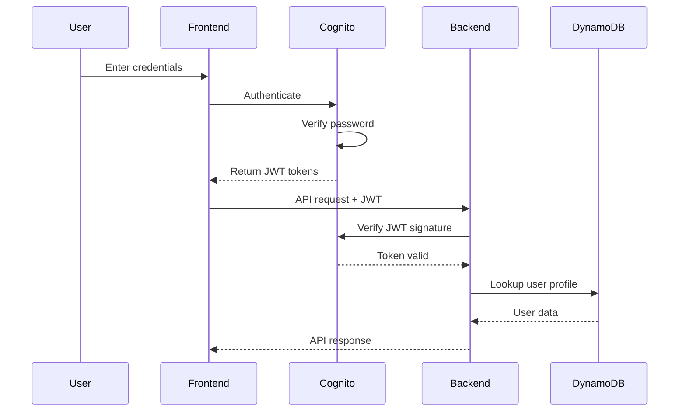

**User Pool Configuration:**

<table>
<tr><th>Setting</th><th>Value</th><th>Rationale</th></tr>
<tr>
<td><b>Pool Name</b></td>
<td><code>dharohar-creators</code></td>
<td>Descriptive name for user base</td>
</tr>
<tr>
<td><b>Sign-in Method</b></td>
<td>Email</td>
<td>Standard, user-friendly</td>
</tr>
<tr>
<td><b>Self Sign-up</b></td>
<td>✅ Enabled</td>
<td>Allow community members to register</td>
</tr>
<tr>
<td><b>Email Verification</b></td>
<td>✅ Auto-verify</td>
<td>Confirm email ownership</td>
</tr>
<tr>
<td><b>Password Policy</b></td>
<td>Min 8 chars, uppercase, digits</td>
<td>Security best practice</td>
</tr>
<tr>
<td><b>MFA</b></td>
<td>⚠️ Optional (not enforced)</td>
<td>Should be required for admin</td>
</tr>
<tr>
<td><b>Token Validity</b></td>
<td>Access: 1hr, Refresh: 30 days</td>
<td>Balance security & UX</td>
</tr>
</table>

**Custom Attributes:**
```javascript
{
  'custom:state': 'Madhya Pradesh',
  'custom:community': 'Gond Community',
  'custom:language': 'hi'
}
```

**Token Structure (JWT):**
```json
{
  "sub": "ca64b155-e13f-4532-8228-aa4026da1f82",
  "email_verified": true,
  "iss": "https://cognito-idp.ap-south-1.amazonaws.com/ap-south-1_XXXXXXX",
  "cognito:username": "lakhan@gond.community",
  "aud": "client-id",
  "event_id": "event-id",
  "token_use": "id",
  "auth_time": 1709971200,
  "exp": 1709974800,
  "iat": 1709971200,
  "email": "lakhan@gond.community"
}
```

**Backend JWT Verification:**
```javascript
const { CognitoJwtVerifier } = require('aws-jwt-verify');

const verifier = CognitoJwtVerifier.create({
  userPoolId: process.env.COGNITO_USER_POOL_ID,
  tokenUse: 'id',
  clientId: process.env.COGNITO_CLIENT_ID
});

const protect = async (req, res, next) => {
  try {
    const token = req.headers.authorization?.split(' ')[1];
    if (!token) {
      return res.status(401).json({ error: 'No token provided' });
    }

    // Verify token (auto-downloads and caches JWKS)
    const payload = await verifier.verify(token);
    
    // Lookup user in DynamoDB
    const user = await userDynamoService.findByEmail(payload.email);
    if (!user) {
      return res.status(401).json({ error: 'User not found' });
    }

    req.user = user;
    next();
  } catch (error) {
    logger.error('Auth error:', error);
    return res.status(401).json({ error: 'Invalid token' });
  }
};
```

**IAM Permissions Required:**
```json
{
  "Version": "2012-10-17",
  "Statement": [{
    "Effect": "Allow",
    "Action": [
      "cognito-idp:AdminGetUser",
      "cognito-idp:AdminCreateUser",
      "cognito-idp:AdminSetUserPassword",
      "cognito-idp:AdminUpdateUserAttributes"
    ],
    "Resource": "arn:aws:cognito-idp:ap-south-1:*:userpool/ap-south-1_*"
  }]
}
```

**💡 Recommendations:**

1. **Implement Token Refresh:**
```javascript
const refreshToken = async (refreshToken) => {
  const response = await cognito.initiateAuth({
    AuthFlow: 'REFRESH_TOKEN_AUTH',
    ClientId: process.env.COGNITO_CLIENT_ID,
    AuthParameters: {
      REFRESH_TOKEN: refreshToken
    }
  });
  return response.AuthenticationResult;
};
```

2. **Add MFA for Admin:**
```javascript
await cognito.setUserMFAPreference({
  Username: email,
  SoftwareTokenMfaSettings: {
    Enabled: true,
    PreferredMfa: true
  }
});
```

3. **Implement Account Lockout:**
```javascript
// After 5 failed attempts, lock for 15 minutes
const loginAttempts = await redis.get(`login:${email}`);
if (loginAttempts >= 5) {
  throw new Error('Account temporarily locked');
}
```

### 🧠 Bedrock Integration

**Model:** Claude 3 Haiku (`anthropic.claude-3-haiku-20240307-v1:0`)

**Use Case:** Extract structured metadata from cultural heritage transcripts

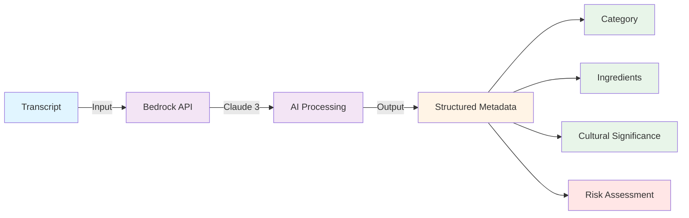

**Prompt Engineering:**
```javascript
const analyseAsset = async (asset, transcript) => {
  const prompt = `You are an expert in Indian cultural heritage and traditional knowledge systems.

Analyze this cultural heritage recording transcript and extract structured information:

TRANSCRIPT:
${transcript}

CONTEXT:
- Asset Type: ${asset.type}
- Community: ${asset.communityName}
- Category: ${asset.metadata.category}
- Location: ${asset.metadata.location}

Extract the following in JSON format:
{
  "primaryCategory": "MEDICINAL | RITUAL | CRAFT | MUSIC",
  "subcategory": "string",
  "keyIngredients": ["ingredient1", "ingredient2"],
  "materials": ["material1", "material2"],
  "culturalSignificance": "detailed explanation",
  "historicalContext": "background information",
  "practiceSteps": ["step1", "step2"],
  "warnings": ["warning1", "warning2"],
  "riskAssessment": "LOW | MEDIUM | HIGH",
  "riskFactors": ["factor1", "factor2"],
  "preservationPriority": "LOW | MEDIUM | HIGH | CRITICAL",
  "relatedPractices": ["practice1", "practice2"],
  "seasonalContext": "when this is typically practiced",
  "ageGroup": "who typically performs this",
  "genderSpecific": "any gender-specific aspects",
  "languageUsed": ["language1", "language2"],
  "dialectNotes": "any dialect-specific information"
}

Be thorough and culturally sensitive. If information is not available, use null.`;

  const response = await bedrockClient.invokeModel({
    modelId: 'anthropic.claude-3-haiku-20240307-v1:0',
    contentType: 'application/json',
    accept: 'application/json',
    body: JSON.stringify({
      anthropic_version: 'bedrock-2023-05-31',
      max_tokens: 2000,
      temperature: 0.3,  // Lower for more consistent output
      messages: [{
        role: 'user',
        content: prompt
      }]
    })
  });

  const result = JSON.parse(response.body);
  const aiMetadata = JSON.parse(result.content[0].text);
  
  return {
    aiMetadata,
    aiProcessed: true
  };
};
```

**Error Handling & Retry Logic:**
```javascript
const analyseAssetWithRetry = async (asset, transcript) => {
  const maxRetries = 3;
  let lastError;

  for (let attempt = 1; attempt <= maxRetries; attempt++) {
    try {
      return await analyseAsset(asset, transcript);
    } catch (error) {
      lastError = error;
      
      if (error.name === 'ThrottlingException') {
        // Exponential backoff
        const delay = Math.pow(2, attempt) * 1000;
        logger.warn(`Bedrock throttled, retrying in ${delay}ms...`);
        await new Promise(resolve => setTimeout(resolve, delay));
        continue;
      }
      
      if (error.name === 'ModelTimeoutException') {
        logger.warn(`Bedrock timeout on attempt ${attempt}`);
        if (attempt < maxRetries) continue;
      }
      
      throw error;
    }
  }
  
  throw lastError;
};
```

**Cost Optimization:**
```javascript
// Cache results to avoid duplicate processing
const cacheKey = `bedrock:${assetId}:${transcriptHash}`;
const cached = await redis.get(cacheKey);
if (cached) {
  return JSON.parse(cached);
}

const result = await analyseAsset(asset, transcript);
await redis.setex(cacheKey, 86400, JSON.stringify(result));  // 24hr cache
return result;
```

**IAM Permissions:**
```json
{
  "Effect": "Allow",
  "Action": [
    "bedrock:InvokeModel",
    "bedrock:InvokeModelWithResponseStream"
  ],
  "Resource": [
    "arn:aws:bedrock:ap-south-1::foundation-model/anthropic.claude-3-haiku-20240307-v1:0"
  ]
}
```

**Monitoring:**
```javascript
// CloudWatch metrics
await cloudwatch.putMetricData({
  Namespace: 'Dharohar/AI',
  MetricData: [{
    MetricName: 'BedrockInvocations',
    Value: 1,
    Unit: 'Count',
    Dimensions: [{
      Name: 'Model',
      Value: 'claude-3-haiku'
    }]
  }, {
    MetricName: 'BedrockLatency',
    Value: duration,
    Unit: 'Milliseconds'
  }, {
    MetricName: 'BedrockTokensUsed',
    Value: tokensUsed,
    Unit: 'Count'
  }]
});
```


### 🎤 Transcribe Integration

**Service:** AWS Transcribe  
**Language:** Hindi (`hi-IN`)  
**Use Case:** Convert audio recordings to text for AI analysis

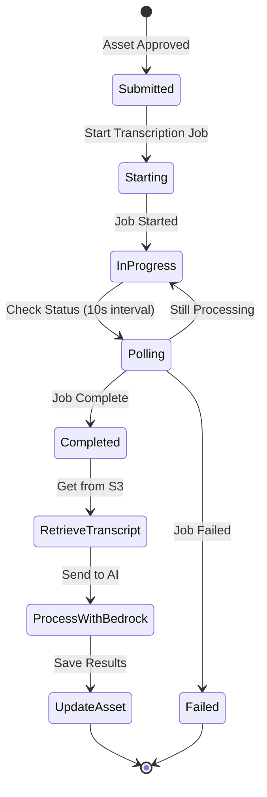

**Implementation:**
```javascript
const { TranscribeClient, StartTranscriptionJobCommand, GetTranscriptionJobCommand } = require('@aws-sdk/client-transcribe');

const transcribeAudio = async (mediaFileId, languageCode = 'hi-IN') => {
  const transcribeClient = new TranscribeClient({ region: 'ap-south-1' });
  const jobName = `dharohar-${mediaFileId}-${Date.now()}`;

  // 1. Start transcription job
  const startCommand = new StartTranscriptionJobCommand({
    TranscriptionJobName: jobName,
    LanguageCode: languageCode,
    MediaFormat: mediaFileId.split('.').pop(),  // mp3, wav, etc.
    Media: {
      MediaFileUri: `s3://dharohar-media-641791054721/${mediaFileId}`
    },
    OutputBucketName: 'dharohar-media-641791054721',
    OutputKey: `transcripts/${mediaFileId}.json`,
    Settings: {
      ShowSpeakerLabels: false,
      MaxSpeakerLabels: 1,
      ChannelIdentification: false,
      ShowAlternatives: false
    }
  });

  await transcribeClient.send(startCommand);
  logger.info(`Transcription job started: ${jobName}`);

  // 2. Poll for completion
  const maxAttempts = 60;  // 10 minutes max
  const pollInterval = 10000;  // 10 seconds

  for (let attempt = 0; attempt < maxAttempts; attempt++) {
    await new Promise(resolve => setTimeout(resolve, pollInterval));

    const getCommand = new GetTranscriptionJobCommand({
      TranscriptionJobName: jobName
    });

    const response = await transcribeClient.send(getCommand);
    const status = response.TranscriptionJob.TranscriptionJobStatus;

    logger.info(`Transcription status: ${status} (attempt ${attempt + 1}/${maxAttempts})`);

    if (status === 'COMPLETED') {
      // 3. Retrieve transcript from S3
      const transcriptUri = response.TranscriptionJob.Transcript.TranscriptFileUri;
      const transcript = await fetchTranscriptFromS3(transcriptUri);
      
      return {
        transcript: transcript.results.transcripts[0].transcript,
        confidence: calculateAverageConfidence(transcript.results.items),
        duration: response.TranscriptionJob.MediaSampleRateHertz,
        jobName
      };
    }

    if (status === 'FAILED') {
      const failureReason = response.TranscriptionJob.FailureReason;
      throw new Error(`Transcription failed: ${failureReason}`);
    }
  }

  throw new Error('Transcription timeout after 10 minutes');
};

const fetchTranscriptFromS3 = async (uri) => {
  const s3Client = new S3Client({ region: 'ap-south-1' });
  const url = new URL(uri);
  const key = url.pathname.substring(1);  // Remove leading /

  const command = new GetObjectCommand({
    Bucket: 'dharohar-media-641791054721',
    Key: key
  });

  const response = await s3Client.send(command);
  const body = await streamToString(response.Body);
  return JSON.parse(body);
};

const calculateAverageConfidence = (items) => {
  const confidences = items
    .filter(item => item.type === 'pronunciation')
    .map(item => parseFloat(item.alternatives[0].confidence));
  
  return confidences.reduce((a, b) => a + b, 0) / confidences.length;
};
```

**Event-Driven Alternative (Recommended):**
```javascript
// Instead of polling, use EventBridge
const eventBridgeRule = {
  Name: 'TranscriptionComplete',
  EventPattern: JSON.stringify({
    source: ['aws.transcribe'],
    'detail-type': ['Transcribe Job State Change'],
    detail: {
      TranscriptionJobStatus: ['COMPLETED', 'FAILED']
    }
  }),
  Targets: [{
    Arn: 'arn:aws:lambda:ap-south-1:xxx:function:ProcessTranscription',
    Id: '1'
  }]
};

// Lambda handler
exports.handler = async (event) => {
  const jobName = event.detail.TranscriptionJobName;
  const status = event.detail.TranscriptionJobStatus;
  
  if (status === 'COMPLETED') {
    const assetId = extractAssetIdFromJobName(jobName);
    const transcript = await fetchTranscript(jobName);
    await processTranscript(assetId, transcript);
  }
};
```

**Multi-Language Support:**
```javascript
const SUPPORTED_LANGUAGES = {
  'hi': 'hi-IN',      // Hindi
  'bn': 'bn-IN',      // Bengali
  'ta': 'ta-IN',      // Tamil
  'te': 'te-IN',      // Telugu
  'mr': 'mr-IN',      // Marathi
  'gu': 'gu-IN',      // Gujarati
  'kn': 'kn-IN',      // Kannada
  'ml': 'ml-IN',      // Malayalam
  'pa': 'pa-IN',      // Punjabi
  'en': 'en-IN'       // English (India)
};

const transcribeWithLanguageDetection = async (mediaFileId, userLanguage) => {
  const languageCode = SUPPORTED_LANGUAGES[userLanguage] || 'hi-IN';
  return await transcribeAudio(mediaFileId, languageCode);
};
```

**Custom Vocabulary (for cultural terms):**
```javascript
const createCustomVocabulary = async () => {
  const vocabulary = {
    VocabularyName: 'DharoharCulturalTerms',
    LanguageCode: 'hi-IN',
    Phrases: [
      'आयुर्वेद',  // Ayurveda
      'हींग',      // Asafoetida
      'हल्दी',     // Turmeric
      'गोंड',      // Gond
      'वारली',     // Warli
      'धरोहर'      // Dharohar
    ]
  };

  await transcribeClient.send(new CreateVocabularyCommand(vocabulary));
};

// Use in transcription
const startCommand = new StartTranscriptionJobCommand({
  // ... other params
  Settings: {
    VocabularyName: 'DharoharCulturalTerms'
  }
});
```

**IAM Permissions:**
```json
{
  "Effect": "Allow",
  "Action": [
    "transcribe:StartTranscriptionJob",
    "transcribe:GetTranscriptionJob",
    "transcribe:ListTranscriptionJobs",
    "transcribe:DeleteTranscriptionJob",
    "s3:GetObject",
    "s3:PutObject"
  ],
  "Resource": "*"
}
```

### ⚡ Lambda Integration

**Functions:**
1. `LicenseContractLambda` - Create immutable license contracts
2. `CertificationContractLambda` - Create asset certifications

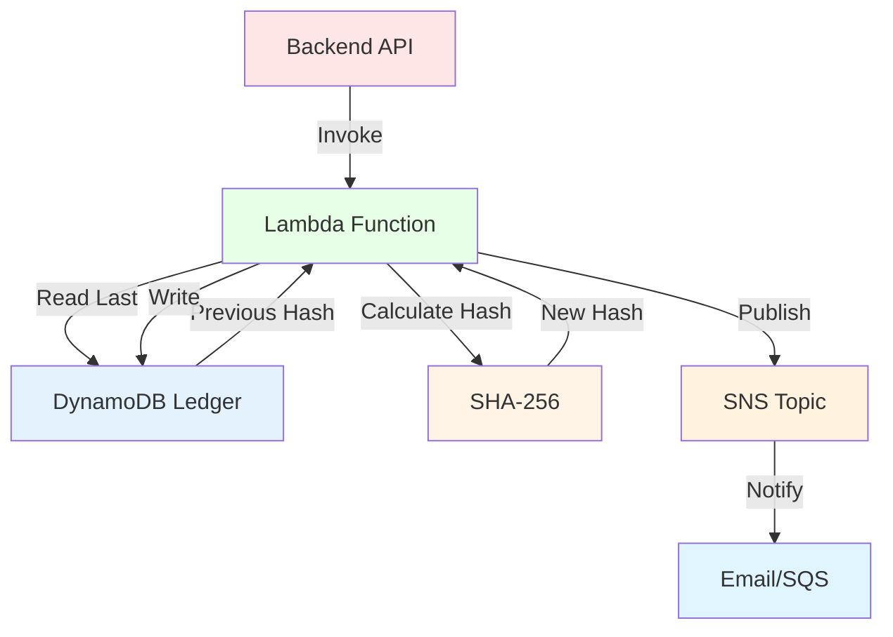

**License Contract Lambda:**
```javascript
// backend/lambdas/license-contract/index.js
const { DynamoDBClient } = require('@aws-sdk/client-dynamodb');
const { DynamoDBDocumentClient, PutCommand, QueryCommand } = require('@aws-sdk/lib-dynamodb');
const { SNSClient, PublishCommand } = require('@aws-sdk/client-sns');
const crypto = require('crypto');

const dynamodb = DynamoDBDocumentClient.from(new DynamoDBClient({}));
const sns = new SNSClient({});

exports.handler = async (event) => {
  console.log('Event:', JSON.stringify(event, null, 2));

  const { action, licenseId, assetId, applicantId, terms } = event;

  if (action === 'CREATE') {
    return await createLicenseContract(licenseId, assetId, applicantId, terms);
  }

  return {
    statusCode: 400,
    body: JSON.stringify({ error: 'Invalid action' })
  };
};

const createLicenseContract = async (licenseId, assetId, applicantId, terms) => {
  const contractId = `LC-${Date.now()}-${Math.random().toString(36).substr(2, 9)}`;

  // 1. Get previous contract for hash chain
  const lastContract = await getLastContract();
  const previousHash = lastContract?.hash || '0';

  // 2. Calculate hash
  const dataToHash = JSON.stringify({
    contractId,
    licenseId,
    assetId,
    applicantId,
    terms,
    previousHash,
    timestamp: new Date().toISOString()
  });

  const hash = crypto.createHash('sha256').update(dataToHash).digest('hex');

  // 3. Create signature (simplified - in production use proper signing)
  const signature = crypto.createHmac('sha256', process.env.SECRET_KEY || 'dharohar-secret')
    .update(hash)
    .digest('hex');

  // 4. Create contract
  const contract = {
    contractId,
    licenseId,
    assetId,
    applicantId,
    terms,
    hash,
    previousHash,
    timestamp: new Date().toISOString(),
    signature,
    blockNumber: (lastContract?.blockNumber || 0) + 1
  };

  // 5. Write to ledger (immutable)
  try {
    await dynamodb.send(new PutCommand({
      TableName: process.env.LEDGER_TABLE,
      Item: contract,
      ConditionExpression: 'attribute_not_exists(contractId)'  // Prevent overwrites
    }));
  } catch (error) {
    if (error.name === 'ConditionalCheckFailedException') {
      console.log('Contract already exists, returning existing');
      return { statusCode: 200, body: JSON.stringify(contract) };
    }
    throw error;
  }

  // 6. Update license with contract ID
  await updateLicense(licenseId, contractId);

  // 7. Publish notification
  await publishNotification(contract);

  console.log('Contract created:', contractId);

  return {
    statusCode: 200,
    body: JSON.stringify({
      success: true,
      contractId,
      transactionId: contractId,
      hash,
      blockNumber: contract.blockNumber
    })
  };
};

const getLastContract = async () => {
  const response = await dynamodb.send(new QueryCommand({
    TableName: process.env.LEDGER_TABLE,
    Limit: 1,
    ScanIndexForward: false,  // Descending order
    // Note: This requires a GSI on timestamp
  }));

  return response.Items?.[0];
};

const updateLicense = async (licenseId, contractId) => {
  const { DynamoDBClient } = require('@aws-sdk/client-dynamodb');
  const { UpdateCommand } = require('@aws-sdk/lib-dynamodb');
  
  await dynamodb.send(new UpdateCommand({
    TableName: process.env.LICENSES_TABLE,
    Key: { id: licenseId },
    UpdateExpression: 'SET smartContractId = :contractId',
    ExpressionAttributeValues: {
      ':contractId': contractId
    }
  }));
};

const publishNotification = async (contract) => {
  await sns.send(new PublishCommand({
    TopicArn: process.env.NOTIFICATION_TOPIC_ARN,
    Subject: 'License Contract Created',
    Message: JSON.stringify({
      type: 'LICENSE_CONTRACT_CREATED',
      contractId: contract.contractId,
      licenseId: contract.licenseId,
      assetId: contract.assetId,
      timestamp: contract.timestamp
    })
  }));
};
```

**Invocation from Backend:**
```javascript
// server/services/smartContractService.js
const { LambdaClient, InvokeCommand } = require('@aws-sdk/client-lambda');

const invokeLicenseContract = async (payload) => {
  const lambda = new LambdaClient({ region: 'ap-south-1' });

  const command = new InvokeCommand({
    FunctionName: 'LicenseContractLambda',
    InvocationType: 'RequestResponse',  // Synchronous
    Payload: JSON.stringify(payload)
  });

  const response = await lambda.send(command);
  const result = JSON.parse(Buffer.from(response.Payload).toString());
  
  return JSON.parse(result.body);
};

// Usage
const result = await invokeLicenseContract({
  action: 'CREATE',
  licenseId: 'license-id',
  assetId: 'asset-id',
  applicantId: 'user-id',
  terms: {
    duration: 12,
    royalty: 5,
    intendedUse: 'Documentary film'
  }
});
```

**Lambda Configuration (CDK):**
```typescript
const licenseContractLambda = new lambda.Function(this, 'LicenseContract', {
  runtime: lambda.Runtime.NODEJS_18_X,
  handler: 'index.handler',
  code: lambda.Code.fromAsset('backend/lambdas/license-contract'),
  timeout: cdk.Duration.seconds(30),
  memorySize: 512,
  environment: {
    LEDGER_TABLE: licenseContractsTable.tableName,
    LICENSES_TABLE: licensesTable.tableName,
    NOTIFICATION_TOPIC_ARN: notificationsTopic.topicArn,
    SECRET_KEY: 'dharohar-signing-key'  // Use Secrets Manager in production
  },
  tracing: lambda.Tracing.ACTIVE,  // Enable X-Ray
  reservedConcurrentExecutions: 10,  // Limit concurrent executions
  deadLetterQueue: dlq,  // Dead letter queue for failures
  retryAttempts: 2
});

// Grant permissions
licenseContractsTable.grantReadWriteData(licenseContractLambda);
licensesTable.grantReadWriteData(licenseContractLambda);
notificationsTopic.grantPublish(licenseContractLambda);

// Add CloudWatch alarm
const errorAlarm = new cloudwatch.Alarm(this, 'LicenseContractErrors', {
  metric: licenseContractLambda.metricErrors(),
  threshold: 5,
  evaluationPeriods: 2,
  alarmDescription: 'Alert when license contract Lambda has errors'
});
```


### 📧 SNS Integration

**Topic:** `dharohar-notifications-{account}`

**Use Cases:**
- License approval notifications
- Asset certification alerts
- Admin notifications
- System alerts

**Message Format:**
```json
{
  "type": "LICENSE_APPROVED | ASSET_CERTIFIED | SYSTEM_ALERT",
  "timestamp": "2026-03-09T12:00:00Z",
  "data": {
    "id": "resource-id",
    "title": "Resource Title",
    "actor": "user-id",
    "details": {}
  }
}
```

**Subscriptions:**
```javascript
// Email subscription for admins
await sns.subscribe({
  TopicArn: topicArn,
  Protocol: 'email',
  Endpoint: 'admin@dharohar.org'
});

// SQS subscription for async processing
await sns.subscribe({
  TopicArn: topicArn,
  Protocol: 'sqs',
  Endpoint: queueArn
});

// Lambda subscription for real-time processing
await sns.subscribe({
  TopicArn: topicArn,
  Protocol: 'lambda',
  Endpoint: lambdaArn
});
```

---

## 🔐 Security & Compliance

<div align="center">

### 🛡️ **Comprehensive Security Analysis**

*OWASP Top 10, AWS Best Practices, and Cultural Data Protection*

</div>

### 🔒 Security Scorecard

<table>
<tr>
<th>Category</th>
<th>Status</th>
<th>Score</th>
<th>Priority</th>
</tr>
<tr>
<td>🔐 Authentication</td>
<td>🟢 Good</td>
<td>8/10</td>
<td>Add MFA for admin</td>
</tr>
<tr>
<td>🛡️ Authorization</td>
<td>🟢 Good</td>
<td>7/10</td>
<td>Add permission granularity</td>
</tr>
<tr>
<td>🔒 Data Encryption</td>
<td>🟡 Moderate</td>
<td>6/10</td>
<td>Add field-level encryption</td>
</tr>
<tr>
<td>🚦 Rate Limiting</td>
<td>🔴 Missing</td>
<td>0/10</td>
<td>⚠️ CRITICAL</td>
</tr>
<tr>
<td>✅ Input Validation</td>
<td>🔴 Missing</td>
<td>2/10</td>
<td>⚠️ CRITICAL</td>
</tr>
<tr>
<td>📝 Audit Logging</td>
<td>🟡 Moderate</td>
<td>5/10</td>
<td>Add structured logging</td>
</tr>
<tr>
<td>🔑 Secrets Management</td>
<td>🟡 Moderate</td>
<td>5/10</td>
<td>Migrate to Secrets Manager</td>
</tr>
<tr>
<td>🌐 CORS</td>
<td>🟡 Moderate</td>
<td>6/10</td>
<td>Harden configuration</td>
</tr>
<tr>
<td>🔍 Vulnerability Scanning</td>
<td>🔴 Missing</td>
<td>0/10</td>
<td>Add to CI/CD</td>
</tr>
<tr>
<td>📊 Security Monitoring</td>
<td>🔴 Missing</td>
<td>0/10</td>
<td>Add CloudWatch alarms</td>
</tr>
</table>

**Overall Security Score: 39/100** 🔴 **Needs Immediate Attention**

### 1️⃣ Authentication & Authorization

**Current Implementation:**
```javascript
// ✅ Good: JWT verification with Cognito
const protect = async (req, res, next) => {
  const token = req.headers.authorization?.split(' ')[1];
  const payload = await verifier.verify(token);
  const user = await userDynamoService.findByEmail(payload.email);
  req.user = user;
  next();
};

// ✅ Good: Role-based access control
const roleGuard = (allowedRoles) => {
  return (req, res, next) => {
    if (!allowedRoles.includes(req.user.role)) {
      return res.status(403).json({ error: 'Forbidden' });
    }
    next();
  };
};
```

**⚠️ Issues:**
- No MFA for admin users
- No session management
- No token refresh logic
- No account lockout after failed attempts

**💡 Recommended Implementation:**
```javascript
// Add MFA verification
const verifyMFA = async (req, res, next) => {
  if (req.user.role === 'admin' && !req.user.mfaVerified) {
    return res.status(403).json({
      error: 'MFA required',
      mfaChallenge: true
    });
  }
  next();
};

// Add session management
const sessionMiddleware = async (req, res, next) => {
  const sessionId = req.headers['x-session-id'];
  const session = await redis.get(`session:${sessionId}`);
  
  if (!session) {
    return res.status(401).json({ error: 'Session expired' });
  }
  
  // Extend session
  await redis.expire(`session:${sessionId}`, 3600);
  next();
};

// Add account lockout
const checkAccountLockout = async (email) => {
  const attempts = await redis.get(`login:attempts:${email}`);
  const lockout = await redis.get(`login:lockout:${email}`);
  
  if (lockout) {
    throw new Error('Account temporarily locked. Try again in 15 minutes.');
  }
  
  if (attempts >= 5) {
    await redis.setex(`login:lockout:${email}`, 900, '1');  // 15 min
    throw new Error('Too many failed attempts. Account locked for 15 minutes.');
  }
};

// Permission-based access (more granular than roles)
const permissions = {
  'asset:create': ['community'],
  'asset:approve': ['review', 'admin'],
  'asset:delete': ['admin'],
  'license:approve': ['admin'],
  'user:manage': ['admin']
};

const requirePermission = (permission) => {
  return (req, res, next) => {
    const allowedRoles = permissions[permission];
    if (!allowedRoles || !allowedRoles.includes(req.user.role)) {
      return res.status(403).json({ error: 'Insufficient permissions' });
    }
    next();
  };
};

// Usage
router.post('/assets', protect, requirePermission('asset:create'), createAsset);
```

### 2️⃣ Input Validation

**⚠️ Current State:** No validation library, manual checks

**💡 Recommended Implementation with Joi:**
```javascript
const Joi = require('joi');

// Define schemas
const schemas = {
  register: Joi.object({
    name: Joi.string().min(2).max(100).required()
      .pattern(/^[a-zA-Z\s]+$/)
      .messages({
        'string.pattern.base': 'Name must contain only letters and spaces'
      }),
    email: Joi.string().email().required()
      .lowercase()
      .trim(),
    password: Joi.string().min(8).max(128).required()
      .pattern(/^(?=.*[a-z])(?=.*[A-Z])(?=.*\d)/)
      .messages({
        'string.pattern.base': 'Password must contain uppercase, lowercase, and digit'
      }),
    communityName: Joi.string().min(2).max(100).required(),
    state: Joi.string().max(50),
    language: Joi.string().length(2).pattern(/^[a-z]{2}$/)
  }),

  createAsset: Joi.object({
    title: Joi.string().min(3).max(200).required()
      .trim(),
    description: Joi.string().min(10).max(2000).required()
      .trim(),
    type: Joi.string().valid('BIO', 'SONIC').required(),
    mediaFileId: Joi.string().uuid().required(),
    recordeeName: Joi.string().min(2).max(100).required()
      .trim(),
    metadata: Joi.object({
      category: Joi.string().valid('MEDICINAL', 'RITUAL', 'CRAFT', 'MUSIC').required(),
      location: Joi.string().max(200),
      performanceContext: Joi.string().max(500),
      timestamp: Joi.string().isoDate()
    }).required()
  }),

  applyLicense: Joi.object({
    assetId: Joi.string().uuid().required(),
    intendedUse: Joi.string().min(50).max(1000).required()
      .trim(),
    duration: Joi.number().integer().min(1).max(60).required(),
    proposedRoyalty: Joi.number().min(0).max(100).required()
  })
};

// Validation middleware
const validate = (schemaName) => {
  return (req, res, next) => {
    const schema = schemas[schemaName];
    if (!schema) {
      return res.status(500).json({ error: 'Validation schema not found' });
    }

    const { error, value } = schema.validate(req.body, {
      abortEarly: false,  // Return all errors
      stripUnknown: true,  // Remove unknown fields
      convert: true  // Type coercion
    });

    if (error) {
      const errors = error.details.map(detail => ({
        field: detail.path.join('.'),
        message: detail.message,
        type: detail.type
      }));

      return res.status(400).json({
        error: 'Validation failed',
        details: errors
      });
    }

    req.body = value;  // Use validated/sanitized data
    next();
  };
};

// Usage
router.post('/auth/register', validate('register'), authController.register);
router.post('/assets', protect, roleGuard(['community']), validate('createAsset'), assetController.createAsset);
```

**Additional Validation:**
```javascript
// Sanitize HTML to prevent XSS
const sanitizeHtml = require('sanitize-html');

const sanitizeInput = (req, res, next) => {
  const sanitize = (obj) => {
    for (const key in obj) {
      if (typeof obj[key] === 'string') {
        obj[key] = sanitizeHtml(obj[key], {
          allowedTags: [],  // Strip all HTML
          allowedAttributes: {}
        });
      } else if (typeof obj[key] === 'object') {
        sanitize(obj[key]);
      }
    }
  };

  sanitize(req.body);
  sanitize(req.query);
  next();
};

app.use(sanitizeInput);
```

### 3️⃣ Rate Limiting

**⚠️ Current State:** Not implemented

**💡 Recommended Implementation:**
```javascript
const rateLimit = require('express-rate-limit');
const RedisStore = require('rate-limit-redis');
const Redis = require('ioredis');

const redis = new Redis(process.env.REDIS_URL);

// Global API rate limit
const apiLimiter = rateLimit({
  store: new RedisStore({
    client: redis,
    prefix: 'rl:api:'
  }),
  windowMs: 60 * 1000,  // 1 minute
  max: 100,  // 100 requests per minute
  standardHeaders: true,
  legacyHeaders: false,
  message: 'Too many requests, please try again later',
  handler: (req, res) => {
    logger.warn('Rate limit exceeded', {
      ip: req.ip,
      path: req.path,
      user: req.user?.id
    });
    res.status(429).json({
      error: 'Too many requests',
      retryAfter: res.getHeader('Retry-After')
    });
  }
});

// Auth endpoints (stricter)
const authLimiter = rateLimit({
  store: new RedisStore({
    client: redis,
    prefix: 'rl:auth:'
  }),
  windowMs: 15 * 60 * 1000,  // 15 minutes
  max: 5,  // 5 attempts
  skipSuccessfulRequests: true,  // Only count failed attempts
  keyGenerator: (req) => {
    return req.body.email || req.ip;  // Rate limit by email or IP
  }
});

// Upload endpoints
const uploadLimiter = rateLimit({
  windowMs: 60 * 60 * 1000,  // 1 hour
  max: 10,  // 10 uploads per hour
  keyGenerator: (req) => req.user.id
});

// Apply limiters
app.use('/api/', apiLimiter);
app.use('/auth/login', authLimiter);
app.use('/auth/register', authLimiter);
app.use('/storage/upload', protect, uploadLimiter);
```


### 4️⃣ Secrets Management

**⚠️ Current State:** Plaintext `.env` files

**💡 Recommended: AWS Secrets Manager**
```javascript
const { SecretsManagerClient, GetSecretValueCommand } = require('@aws-sdk/client-secrets-manager');

class SecretsManager {
  constructor() {
    this.client = new SecretsManagerClient({ region: 'ap-south-1' });
    this.cache = new Map();
    this.cacheTTL = 300000;  // 5 minutes
  }

  async getSecret(secretName) {
    // Check cache
    const cached = this.cache.get(secretName);
    if (cached && Date.now() - cached.timestamp < this.cacheTTL) {
      return cached.value;
    }

    // Fetch from Secrets Manager
    const command = new GetSecretValueCommand({ SecretId: secretName });
    const response = await this.client.send(command);
    const secret = JSON.parse(response.SecretString);

    // Cache
    this.cache.set(secretName, {
      value: secret,
      timestamp: Date.now()
    });

    return secret;
  }

  async getDatabaseCredentials() {
    return await this.getSecret('dharohar/database');
  }

  async getAPIKeys() {
    return await this.getSecret('dharohar/api-keys');
  }
}

// Usage
const secretsManager = new SecretsManager();
const dbCreds = await secretsManager.getDatabaseCredentials();
```

**Secret Rotation:**
```javascript
// Lambda function for automatic rotation
exports.handler = async (event) => {
  const { SecretId, Token, Step } = event;

  if (Step === 'createSecret') {
    // Generate new secret
    const newPassword = generateSecurePassword();
    await secretsManager.putSecretValue({
      SecretId,
      SecretString: JSON.stringify({ password: newPassword }),
      VersionStages: ['AWSPENDING']
    });
  }

  if (Step === 'setSecret') {
    // Update database with new password
    await updateDatabasePassword(newPassword);
  }

  if (Step === 'testSecret') {
    // Test new credentials
    await testDatabaseConnection(newPassword);
  }

  if (Step === 'finishSecret') {
    // Mark as current
    await secretsManager.updateSecretVersionStage({
      SecretId,
      VersionStage: 'AWSCURRENT',
      MoveToVersionId: Token
    });
  }
};
```

### 5️⃣ Data Encryption

**Current State:**
- ✅ S3: Server-side encryption (SSE-S3)
- ✅ DynamoDB: Encryption at rest
- ⚠️ No field-level encryption
- ⚠️ No client-side encryption

**💡 Field-Level Encryption:**
```javascript
const crypto = require('crypto');

class FieldEncryption {
  constructor(masterKey) {
    this.algorithm = 'aes-256-gcm';
    this.masterKey = Buffer.from(masterKey, 'hex');
  }

  encrypt(text) {
    const iv = crypto.randomBytes(16);
    const cipher = crypto.createCipheriv(this.algorithm, this.masterKey, iv);
    
    let encrypted = cipher.update(text, 'utf8', 'hex');
    encrypted += cipher.final('hex');
    
    const authTag = cipher.getAuthTag();
    
    return {
      encrypted,
      iv: iv.toString('hex'),
      authTag: authTag.toString('hex')
    };
  }

  decrypt(encrypted, iv, authTag) {
    const decipher = crypto.createDecipheriv(
      this.algorithm,
      this.masterKey,
      Buffer.from(iv, 'hex')
    );
    
    decipher.setAuthTag(Buffer.from(authTag, 'hex'));
    
    let decrypted = decipher.update(encrypted, 'hex', 'utf8');
    decrypted += decipher.final('utf8');
    
    return decrypted;
  }
}

// Usage for sensitive fields
const encryption = new FieldEncryption(process.env.ENCRYPTION_KEY);

const saveUser = async (userData) => {
  // Encrypt sensitive fields
  const encryptedEmail = encryption.encrypt(userData.email);
  
  await dynamodb.putItem({
    TableName: 'UsersTable',
    Item: {
      id: userData.id,
      email_encrypted: encryptedEmail.encrypted,
      email_iv: encryptedEmail.iv,
      email_authTag: encryptedEmail.authTag,
      // ... other fields
    }
  });
};
```

### 6️⃣ CORS Hardening

**Current Configuration:**
```javascript
// ⚠️ Issues: localhost in production, wildcard origins
app.use(cors({
  origin: [
    'https://dharoharawsconfig.d27b8apzpiwf2t.amplifyapp.com',
    'http://localhost:5173'  // ⚠️ Remove in production
  ],
  credentials: true
}));
```

**💡 Hardened Configuration:**
```javascript
const allowedOrigins = {
  production: [
    'https://dharoharawsconfig.d27b8apzpiwf2t.amplifyapp.com',
    'https://dharohar.org'
  ],
  development: [
    'http://localhost:5173',
    'http://localhost:3000'
  ]
};

const corsOptions = {
  origin: (origin, callback) => {
    const origins = process.env.NODE_ENV === 'production'
      ? allowedOrigins.production
      : [...allowedOrigins.production, ...allowedOrigins.development];

    if (!origin || origins.includes(origin)) {
      callback(null, true);
    } else {
      logger.warn('CORS blocked', { origin });
      callback(new Error('Not allowed by CORS'));
    }
  },
  credentials: true,
  methods: ['GET', 'POST', 'PUT', 'PATCH', 'DELETE'],
  allowedHeaders: ['Content-Type', 'Authorization'],
  exposedHeaders: ['X-Total-Count', 'X-Page'],
  maxAge: 86400,  // 24 hours
  preflightContinue: false,
  optionsSuccessStatus: 204
};

app.use(cors(corsOptions));
```

### 7️⃣ Security Headers

**💡 Implementation with Helmet:**
```javascript
const helmet = require('helmet');

app.use(helmet({
  contentSecurityPolicy: {
    directives: {
      defaultSrc: ["'self'"],
      styleSrc: ["'self'", "'unsafe-inline'", "https://fonts.googleapis.com"],
      scriptSrc: ["'self'"],
      imgSrc: ["'self'", "data:", "https:", "blob:"],
      fontSrc: ["'self'", "https://fonts.gstatic.com"],
      connectSrc: [
        "'self'",
        "https://q3eyidaaed.execute-api.ap-south-1.amazonaws.com",
        "https://dharohar-media-641791054721.s3.ap-south-1.amazonaws.com"
      ],
      mediaSrc: ["'self'", "https://dharohar-media-641791054721.s3.ap-south-1.amazonaws.com"],
      objectSrc: ["'none'"],
      frameSrc: ["'none'"],
      baseUri: ["'self'"],
      formAction: ["'self'"],
      frameAncestors: ["'none'"],
      upgradeInsecureRequests: []
    }
  },
  hsts: {
    maxAge: 31536000,  // 1 year
    includeSubDomains: true,
    preload: true
  },
  noSniff: true,
  referrerPolicy: { policy: 'strict-origin-when-cross-origin' },
  xssFilter: true,
  hidePoweredBy: true
}));

// Additional security headers
app.use((req, res, next) => {
  res.setHeader('X-Content-Type-Options', 'nosniff');
  res.setHeader('X-Frame-Options', 'DENY');
  res.setHeader('X-XSS-Protection', '1; mode=block');
  res.setHeader('Permissions-Policy', 'geolocation=(), microphone=(), camera=()');
  next();
});
```

### 8️⃣ Audit Logging

**💡 Comprehensive Audit Trail:**
```javascript
const auditLog = async (action, resource, userId, details = {}) => {
  const logEntry = {
    id: uuidv4(),
    timestamp: new Date().toISOString(),
    action,  // CREATE, UPDATE, DELETE, APPROVE, REJECT
    resource,  // ASSET, LICENSE, USER
    resourceId: details.resourceId,
    userId,
    userRole: details.userRole,
    ip: details.ip,
    userAgent: details.userAgent,
    changes: details.changes,  // Before/after for updates
    result: details.result,  // SUCCESS, FAILURE
    errorMessage: details.errorMessage
  };

  // Write to DynamoDB
  await dynamodb.putItem({
    TableName: 'AuditLogsTable',
    Item: logEntry
  });

  // Also log to CloudWatch for analysis
  logger.info('Audit', logEntry);
};

// Middleware to auto-log all actions
const auditMiddleware = (action, resource) => {
  return async (req, res, next) => {
    const originalSend = res.send;
    
    res.send = function(data) {
      // Log after response
      auditLog(action, resource, req.user?.id, {
        resourceId: req.params.id,
        userRole: req.user?.role,
        ip: req.ip,
        userAgent: req.get('user-agent'),
        result: res.statusCode < 400 ? 'SUCCESS' : 'FAILURE'
      }).catch(err => logger.error('Audit log failed', err));
      
      originalSend.call(this, data);
    };
    
    next();
  };
};

// Usage
router.patch('/:id/approve',
  protect,
  roleGuard(['review']),
  auditMiddleware('APPROVE', 'ASSET'),
  assetController.approveAsset
);
```

### 9️⃣ File Upload Security

**💡 Comprehensive File Validation:**
```javascript
const fileType = require('file-type');
const crypto = require('crypto');

const validateFile = async (buffer, declaredMimeType) => {
  // 1. Check file size
  const maxSize = 500 * 1024 * 1024;  // 500MB
  if (buffer.length > maxSize) {
    throw new Error('File too large');
  }

  // 2. Verify actual file type (magic bytes)
  const actualType = await fileType.fromBuffer(buffer);
  if (!actualType) {
    throw new Error('Unknown file type');
  }

  // 3. Whitelist allowed types
  const allowedTypes = {
    'audio/mpeg': ['.mp3'],
    'audio/wav': ['.wav'],
    'audio/x-wav': ['.wav'],
    'video/mp4': ['.mp4'],
    'video/quicktime': ['.mov'],
    'application/pdf': ['.pdf']
  };

  if (!allowedTypes[actualType.mime]) {
    throw new Error(`File type not allowed: ${actualType.mime}`);
  }

  // 4. Verify declared type matches actual type
  if (declaredMimeType !== actualType.mime) {
    throw new Error('File type mismatch');
  }

  // 5. Scan for malware (integrate with ClamAV)
  await scanForMalware(buffer);

  // 6. Calculate hash for integrity
  const hash = crypto.createHash('sha256').update(buffer).digest('hex');

  return {
    valid: true,
    mimeType: actualType.mime,
    extension: actualType.ext,
    hash
  };
};

const scanForMalware = async (buffer) => {
  // Integrate with ClamAV Lambda or third-party service
  const response = await fetch('https://clamav-api.example.com/scan', {
    method: 'POST',
    body: buffer
  });

  const result = await response.json();
  if (result.infected) {
    throw new Error('Malware detected');
  }
};
```

### 🔟 PII Protection

**💡 Data Masking & Anonymization:**
```javascript
const maskEmail = (email) => {
  const [local, domain] = email.split('@');
  const maskedLocal = local[0] + '*'.repeat(local.length - 2) + local[local.length - 1];
  return `${maskedLocal}@${domain}`;
};

const hashUserId = (userId) => {
  return crypto.createHash('sha256').update(userId).digest('hex').substring(0, 16);
};

// Logging without PII
logger.info('User action', {
  userId: hashUserId(user.id),
  email: maskEmail(user.email),
  action: 'asset_created'
});

// API responses without sensitive data
const sanitizeUser = (user) => {
  const { password, ...safeUser } = user;
  return safeUser;
};
```

---

## 🧪 Testing & CI/CD

<div align="center">

### 🔬 **Comprehensive Testing Strategy**

*Unit, Integration, E2E, and Performance Testing*

</div>

### 📊 Test Coverage Goals

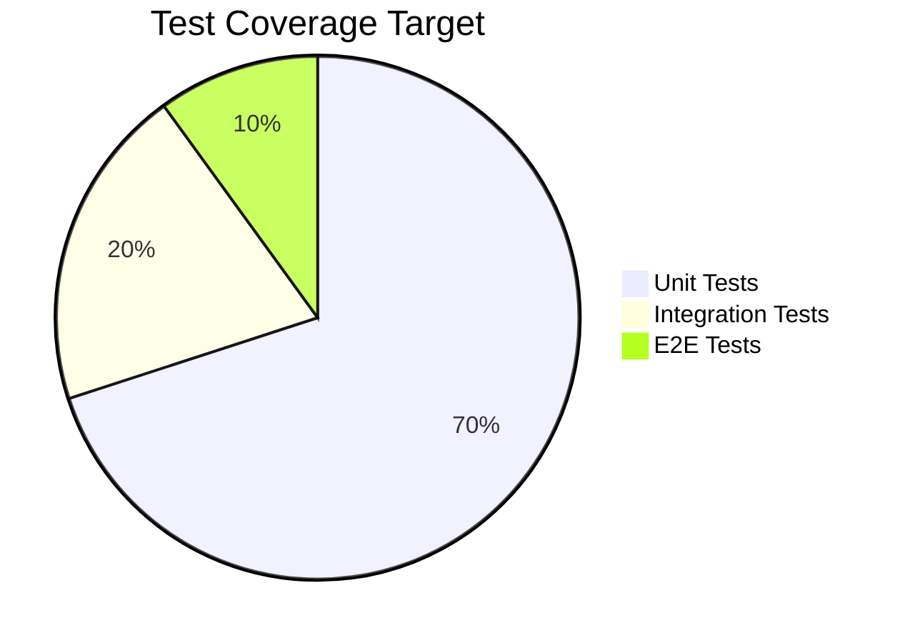

**Current Coverage:** ⚠️ ~5% (CDK tests only)  
**Target Coverage:** ✅ 70%+ overall


### ⚠️ Current State

<table>
<tr>
<th>Test Type</th>
<th>Status</th>
<th>Coverage</th>
<th>Priority</th>
</tr>
<tr>
<td>Unit Tests</td>
<td>🔴 Missing</td>
<td>~2%</td>
<td>⚠️ CRITICAL</td>
</tr>
<tr>
<td>Integration Tests</td>
<td>🔴 Missing</td>
<td>0%</td>
<td>HIGH</td>
</tr>
<tr>
<td>E2E Tests</td>
<td>🔴 Missing</td>
<td>0%</td>
<td>MEDIUM</td>
</tr>
<tr>
<td>CDK Tests</td>
<td>🟢 Exists</td>
<td>~5%</td>
<td>Expand</td>
</tr>
<tr>
<td>Performance Tests</td>
<td>🔴 Missing</td>
<td>0%</td>
<td>MEDIUM</td>
</tr>
</table>

### 1️⃣ Unit Testing with Jest

**Setup:**
```bash
npm install --save-dev jest @types/jest ts-jest supertest @types/supertest
```

**Configuration (`jest.config.js`):**
```javascript
module.exports = {
  preset: 'ts-jest',
  testEnvironment: 'node',
  roots: ['<rootDir>/server'],
  testMatch: ['**/__tests__/**/*.test.ts', '**/?(*.)+(spec|test).ts'],
  collectCoverageFrom: [
    'server/**/*.{js,ts}',
    '!server/**/*.d.ts',
    '!server/node_modules/**',
    '!server/dist/**'
  ],
  coverageThreshold: {
    global: {
      branches: 70,
      functions: 70,
      lines: 70,
      statements: 70
    }
  },
  setupFilesAfterEnv: ['<rootDir>/server/__tests__/setup.ts']
};
```


**Example Unit Tests:**

```javascript
// server/__tests__/services/assetDynamoService.test.ts
import { assetDynamoService } from '../../services/assetDynamoService';
import { DynamoDBDocumentClient } from '@aws-sdk/lib-dynamodb';

jest.mock('@aws-sdk/lib-dynamodb');

describe('AssetDynamoService', () => {
  let mockDynamoDB: jest.Mocked<DynamoDBDocumentClient>;

  beforeEach(() => {
    mockDynamoDB = {
      send: jest.fn()
    } as any;
    jest.clearAllMocks();
  });

  describe('createAsset', () => {
    it('should create asset with correct structure', async () => {
      const assetData = {
        title: 'Test Asset',
        description: 'Test description',
        type: 'BIO',
        mediaFileId: 'test-file.mp3',
        recordeeName: 'Test Recorder',
        createdBy: 'user-123',
        communityName: 'Test Community',
        metadata: {
          category: 'MEDICINAL',
          location: '22.7° N, 75.8° E'
        }
      };

      mockDynamoDB.send.mockResolvedValueOnce({});

      const result = await assetDynamoService.createAsset(assetData);

      expect(result).toHaveProperty('id');
      expect(result.approvalStatus).toBe('PENDING');
      expect(result.isCertified).toBe(false);
      expect(mockDynamoDB.send).toHaveBeenCalledTimes(1);
    });

    it('should throw error for invalid asset type', async () => {
      const invalidData = {
        type: 'INVALID'
      } as any;

      await expect(assetDynamoService.createAsset(invalidData))
        .rejects.toThrow('Invalid asset type');
    });
  });

  describe('findById', () => {
    it('should return asset with media URL', async () => {
      const mockAsset = {
        id: 'asset-123',
        title: 'Test Asset',
        type: 'SONIC',
        mediaFileId: 'test.mp3'
      };

      mockDynamoDB.send.mockResolvedValueOnce({ Item: mockAsset });

      const result = await assetDynamoService.findById('asset-123');

      expect(result).toHaveProperty('mediaUrl');
      expect(result.mediaUrl).toContain('s3.ap-south-1.amazonaws.com');
    });

    it('should return null for non-existent asset', async () => {
      mockDynamoDB.send.mockResolvedValueOnce({});

      const result = await assetDynamoService.findById('non-existent');

      expect(result).toBeNull();
    });
  });
});
```


```javascript
// server/__tests__/controllers/assetController.test.ts
import request from 'supertest';
import app from '../../app';
import { assetDynamoService } from '../../services/assetDynamoService';
import { transcribeService } from '../../services/transcribeService';

jest.mock('../../services/assetDynamoService');
jest.mock('../../services/transcribeService');
jest.mock('../../middleware/auth');

describe('Asset Controller', () => {
  describe('POST /assets', () => {
    it('should create asset successfully', async () => {
      const mockAsset = {
        id: 'asset-123',
        title: 'Test Asset',
        approvalStatus: 'PENDING'
      };

      (assetDynamoService.createAsset as jest.Mock).mockResolvedValue(mockAsset);

      const response = await request(app)
        .post('/assets')
        .set('Authorization', 'Bearer mock-token')
        .send({
          title: 'Test Asset',
          description: 'Test description',
          type: 'BIO',
          mediaFileId: 'test.mp3',
          recordeeName: 'Test Recorder',
          metadata: {
            category: 'MEDICINAL'
          }
        });

      expect(response.status).toBe(201);
      expect(response.body).toHaveProperty('id');
      expect(response.body.approvalStatus).toBe('PENDING');
    });

    it('should return 400 for missing required fields', async () => {
      const response = await request(app)
        .post('/assets')
        .set('Authorization', 'Bearer mock-token')
        .send({
          title: 'Test Asset'
          // Missing required fields
        });

      expect(response.status).toBe(400);
      expect(response.body).toHaveProperty('error');
    });

    it('should return 401 without authentication', async () => {
      const response = await request(app)
        .post('/assets')
        .send({
          title: 'Test Asset'
        });

      expect(response.status).toBe(401);
    });
  });

  describe('PATCH /assets/:id/approve', () => {
    it('should approve asset and trigger transcription for BIO', async () => {
      const mockAsset = {
        id: 'asset-123',
        type: 'BIO',
        mediaFileId: 'test.mp3',
        approvalStatus: 'APPROVED'
      };

      (assetDynamoService.findById as jest.Mock).mockResolvedValue(mockAsset);
      (assetDynamoService.updateAsset as jest.Mock).mockResolvedValue(mockAsset);
      (transcribeService.transcribeAudio as jest.Mock).mockResolvedValue({
        transcript: 'Test transcript'
      });

      const response = await request(app)
        .patch('/assets/asset-123/approve')
        .set('Authorization', 'Bearer reviewer-token');

      expect(response.status).toBe(200);
      expect(response.body.approvalStatus).toBe('APPROVED');
      expect(transcribeService.transcribeAudio).toHaveBeenCalled();
    });
  });
});
```


### 2️⃣ Integration Testing

**Setup:**
```bash
npm install --save-dev @testcontainers/localstack aws-sdk-client-mock
```

**DynamoDB Integration Tests:**
```javascript
// server/__tests__/integration/asset.integration.test.ts
import { DynamoDBClient } from '@aws-sdk/client-dynamodb';
import { DynamoDBDocumentClient, PutCommand, GetCommand } from '@aws-sdk/lib-dynamodb';
import { GenericContainer, StartedTestContainer } from 'testcontainers';

describe('Asset Integration Tests', () => {
  let container: StartedTestContainer;
  let dynamoClient: DynamoDBDocumentClient;

  beforeAll(async () => {
    // Start LocalStack container
    container = await new GenericContainer('localstack/localstack')
      .withExposedPorts(4566)
      .withEnvironment({
        SERVICES: 'dynamodb',
        DEFAULT_REGION: 'us-east-1'
      })
      .start();

    const endpoint = `http://${container.getHost()}:${container.getMappedPort(4566)}`;
    
    dynamoClient = DynamoDBDocumentClient.from(
      new DynamoDBClient({
        endpoint,
        region: 'us-east-1',
        credentials: {
          accessKeyId: 'test',
          secretAccessKey: 'test'
        }
      })
    );

    // Create test table
    await createTestTable(dynamoClient);
  }, 60000);

  afterAll(async () => {
    await container.stop();
  });

  it('should create and retrieve asset', async () => {
    const asset = {
      id: 'test-asset-1',
      title: 'Integration Test Asset',
      type: 'BIO',
      approvalStatus: 'PENDING'
    };

    await dynamoClient.send(new PutCommand({
      TableName: 'AssetsTable',
      Item: asset
    }));

    const result = await dynamoClient.send(new GetCommand({
      TableName: 'AssetsTable',
      Key: { id: 'test-asset-1' }
    }));

    expect(result.Item).toMatchObject(asset);
  });
});
```


### 3️⃣ End-to-End Testing with Playwright

**Setup:**
```bash
cd frontend
npm install --save-dev @playwright/test
npx playwright install
```

**Configuration (`playwright.config.ts`):**
```typescript
import { defineConfig, devices } from '@playwright/test';

export default defineConfig({
  testDir: './e2e',
  fullyParallel: true,
  forbidOnly: !!process.env.CI,
  retries: process.env.CI ? 2 : 0,
  workers: process.env.CI ? 1 : undefined,
  reporter: 'html',
  use: {
    baseURL: 'http://localhost:5173',
    trace: 'on-first-retry',
    screenshot: 'only-on-failure'
  },
  projects: [
    {
      name: 'chromium',
      use: { ...devices['Desktop Chrome'] }
    },
    {
      name: 'firefox',
      use: { ...devices['Desktop Firefox'] }
    },
    {
      name: 'webkit',
      use: { ...devices['Desktop Safari'] }
    }
  ],
  webServer: {
    command: 'npm run dev',
    url: 'http://localhost:5173',
    reuseExistingServer: !process.env.CI
  }
});
```

**Example E2E Tests:**
```typescript
// frontend/e2e/auth.spec.ts
import { test, expect } from '@playwright/test';

test.describe('Authentication Flow', () => {
  test('should register new user', async ({ page }) => {
    await page.goto('/register');

    await page.fill('input[name="name"]', 'Test User');
    await page.fill('input[name="email"]', 'test@example.com');
    await page.fill('input[name="password"]', 'SecurePass123!');
    await page.fill('input[name="communityName"]', 'Test Community');

    await page.click('button[type="submit"]');

    await expect(page).toHaveURL('/dashboard');
    await expect(page.locator('text=Welcome, Test User')).toBeVisible();
  });

  test('should login existing user', async ({ page }) => {
    await page.goto('/login');

    await page.fill('input[name="email"]', 'lakhan@gond.community');
    await page.fill('input[name="password"]', 'SecurePass123!');

    await page.click('button[type="submit"]');

    await expect(page).toHaveURL('/dashboard');
  });

  test('should show error for invalid credentials', async ({ page }) => {
    await page.goto('/login');

    await page.fill('input[name="email"]', 'wrong@example.com');
    await page.fill('input[name="password"]', 'WrongPass123!');

    await page.click('button[type="submit"]');

    await expect(page.locator('text=Invalid email or password')).toBeVisible();
  });
});
```


```typescript
// frontend/e2e/asset-workflow.spec.ts
import { test, expect } from '@playwright/test';

test.describe('Asset Creation Workflow', () => {
  test.beforeEach(async ({ page }) => {
    // Login as community member
    await page.goto('/login');
    await page.fill('input[name="email"]', 'lakhan@gond.community');
    await page.fill('input[name="password"]', 'SecurePass123!');
    await page.click('button[type="submit"]');
    await expect(page).toHaveURL('/dashboard');
  });

  test('should create new BIO asset', async ({ page }) => {
    await page.goto('/dashboard/assets/create');

    await page.fill('input[name="title"]', 'Traditional Healing Remedy');
    await page.fill('textarea[name="description"]', 'Turmeric and asafoetida paste for stomach pain');
    await page.selectOption('select[name="type"]', 'BIO');
    await page.fill('input[name="recordeeName"]', 'Ram Prasad');
    await page.selectOption('select[name="category"]', 'MEDICINAL');

    // Upload file
    const fileInput = page.locator('input[type="file"]');
    await fileInput.setInputFiles('test-fixtures/remedy.mp3');

    await page.click('button[type="submit"]');

    await expect(page.locator('text=Asset created successfully')).toBeVisible();
    await expect(page).toHaveURL(/\/dashboard\/assets\/mine/);
  });

  test('should display pending assets', async ({ page }) => {
    await page.goto('/dashboard/assets/mine');

    await expect(page.locator('[data-testid="asset-card"]')).toHaveCount(1);
    await expect(page.locator('text=PENDING')).toBeVisible();
  });
});

test.describe('Review Workflow', () => {
  test.beforeEach(async ({ page }) => {
    // Login as reviewer
    await page.goto('/login');
    await page.fill('input[name="email"]', 'reviewer@dharohar.org');
    await page.fill('input[name="password"]', 'Reviewer123!');
    await page.click('button[type="submit"]');
  });

  test('should approve asset', async ({ page }) => {
    await page.goto('/dashboard/review-queue');

    const firstAsset = page.locator('[data-testid="asset-card"]').first();
    await firstAsset.locator('button:has-text("Approve")').click();

    await expect(page.locator('text=Asset approved successfully')).toBeVisible();
  });

  test('should reject asset with comment', async ({ page }) => {
    await page.goto('/dashboard/review-queue');

    const firstAsset = page.locator('[data-testid="asset-card"]').first();
    await firstAsset.locator('button:has-text("Reject")').click();

    await page.fill('textarea[name="reviewComment"]', 'Audio quality is too low');
    await page.click('button:has-text("Confirm Rejection")');

    await expect(page.locator('text=Asset rejected')).toBeVisible();
  });
});
```


### 4️⃣ CI/CD Pipeline

**GitHub Actions Workflow (`.github/workflows/ci.yml`):**
```yaml
name: CI/CD Pipeline

on:
  push:
    branches: [main, DharoharAWSConfig]
  pull_request:
    branches: [main]

jobs:
  lint:
    runs-on: ubuntu-latest
    steps:
      - uses: actions/checkout@v3
      
      - name: Setup Node.js
        uses: actions/setup-node@v3
        with:
          node-version: '18'
          cache: 'npm'
      
      - name: Install dependencies
        run: npm ci
      
      - name: Run ESLint
        run: npm run lint
      
      - name: Run TypeScript check
        run: npm run typecheck

  test-backend:
    runs-on: ubuntu-latest
    steps:
      - uses: actions/checkout@v3
      
      - name: Setup Node.js
        uses: actions/setup-node@v3
        with:
          node-version: '18'
      
      - name: Install dependencies
        working-directory: ./server
        run: npm ci
      
      - name: Run unit tests
        working-directory: ./server
        run: npm test -- --coverage
      
      - name: Upload coverage to Codecov
        uses: codecov/codecov-action@v3
        with:
          files: ./server/coverage/lcov.info
          flags: backend

  test-frontend:
    runs-on: ubuntu-latest
    steps:
      - uses: actions/checkout@v3
      
      - name: Setup Node.js
        uses: actions/setup-node@v3
        with:
          node-version: '18'
      
      - name: Install dependencies
        working-directory: ./frontend
        run: npm ci
      
      - name: Run unit tests
        working-directory: ./frontend
        run: npm test -- --coverage
      
      - name: Upload coverage
        uses: codecov/codecov-action@v3
        with:
          files: ./frontend/coverage/lcov.info
          flags: frontend

  e2e-tests:
    runs-on: ubuntu-latest
    steps:
      - uses: actions/checkout@v3
      
      - name: Setup Node.js
        uses: actions/setup-node@v3
        with:
          node-version: '18'
      
      - name: Install dependencies
        working-directory: ./frontend
        run: npm ci
      
      - name: Install Playwright
        working-directory: ./frontend
        run: npx playwright install --with-deps
      
      - name: Run E2E tests
        working-directory: ./frontend
        run: npm run test:e2e
      
      - name: Upload test results
        if: always()
        uses: actions/upload-artifact@v3
        with:
          name: playwright-report
          path: frontend/playwright-report/

  security-scan:
    runs-on: ubuntu-latest
    steps:
      - uses: actions/checkout@v3
      
      - name: Run npm audit
        run: npm audit --audit-level=moderate
      
      - name: Run Snyk security scan
        uses: snyk/actions/node@master
        env:
          SNYK_TOKEN: ${{ secrets.SNYK_TOKEN }}
        with:
          args: --severity-threshold=high

  build-backend:
    needs: [lint, test-backend]
    runs-on: ubuntu-latest
    steps:
      - uses: actions/checkout@v3
      
      - name: Setup Node.js
        uses: actions/setup-node@v3
        with:
          node-version: '18'
      
      - name: Install dependencies
        working-directory: ./server
        run: npm ci
      
      - name: Build
        working-directory: ./server
        run: npm run build

  build-frontend:
    needs: [lint, test-frontend]
    runs-on: ubuntu-latest
    steps:
      - uses: actions/checkout@v3
      
      - name: Setup Node.js
        uses: actions/setup-node@v3
        with:
          node-version: '18'
      
      - name: Install dependencies
        working-directory: ./frontend
        run: npm ci
      
      - name: Build
        working-directory: ./frontend
        run: npm run build
        env:
          VITE_API_URL: ${{ secrets.VITE_API_URL }}
      
      - name: Upload build artifacts
        uses: actions/upload-artifact@v3
        with:
          name: frontend-build
          path: frontend/dist/

  deploy-backend:
    needs: [build-backend, security-scan]
    if: github.ref == 'refs/heads/DharoharAWSConfig'
    runs-on: ubuntu-latest
    steps:
      - uses: actions/checkout@v3
      
      - name: Deploy to EC2
        uses: appleboy/scp-action@master
        with:
          host: ${{ secrets.EC2_HOST }}
          username: ubuntu
          key: ${{ secrets.EC2_SSH_KEY }}
          source: "server/*"
          target: "~/Dharohar-MVP/"
      
      - name: Restart PM2
        uses: appleboy/ssh-action@master
        with:
          host: ${{ secrets.EC2_HOST }}
          username: ubuntu
          key: ${{ secrets.EC2_SSH_KEY }}
          script: |
            cd ~/Dharohar-MVP/server
            npm install --production
            pm2 restart dharohar-api

  deploy-frontend:
    needs: [build-frontend, e2e-tests]
    if: github.ref == 'refs/heads/DharoharAWSConfig'
    runs-on: ubuntu-latest
    steps:
      - uses: actions/checkout@v3
      
      - name: Configure AWS credentials
        uses: aws-actions/configure-aws-credentials@v2
        with:
          aws-access-key-id: ${{ secrets.AWS_ACCESS_KEY_ID }}
          aws-secret-access-key: ${{ secrets.AWS_SECRET_ACCESS_KEY }}
          aws-region: ap-south-1
      
      - name: Trigger Amplify deployment
        run: |
          aws amplify start-job \
            --app-id ${{ secrets.AMPLIFY_APP_ID }} \
            --branch-name DharoharAWSConfig \
            --job-type RELEASE
```


### 5️⃣ Smoke Tests

**Post-Deployment Smoke Tests:**
```bash
#!/bin/bash
# scripts/smoke-test.sh

API_URL="https://q3eyidaaed.execute-api.ap-south-1.amazonaws.com"
FRONTEND_URL="https://dharoharawsconfig.d27b8apzpiwf2t.amplifyapp.com"

echo "🔥 Running smoke tests..."

# Test 1: API Health Check
echo "Testing API health..."
response=$(curl -s -o /dev/null -w "%{http_code}" "$API_URL/health")
if [ "$response" -eq 200 ]; then
  echo "✅ API health check passed"
else
  echo "❌ API health check failed (HTTP $response)"
  exit 1
fi

# Test 2: Frontend loads
echo "Testing frontend..."
response=$(curl -s -o /dev/null -w "%{http_code}" "$FRONTEND_URL")
if [ "$response" -eq 200 ]; then
  echo "✅ Frontend loads successfully"
else
  echo "❌ Frontend failed to load (HTTP $response)"
  exit 1
fi

# Test 3: Public assets endpoint
echo "Testing public assets endpoint..."
response=$(curl -s "$API_URL/assets/public")
if echo "$response" | jq -e '.assets' > /dev/null 2>&1; then
  echo "✅ Public assets endpoint working"
else
  echo "❌ Public assets endpoint failed"
  exit 1
fi

# Test 4: Authentication endpoint
echo "Testing auth endpoint..."
response=$(curl -s -X POST "$API_URL/auth/login" \
  -H "Content-Type: application/json" \
  -d '{"email":"test@example.com","password":"wrong"}')
if echo "$response" | jq -e '.error' > /dev/null 2>&1; then
  echo "✅ Auth endpoint responding correctly"
else
  echo "❌ Auth endpoint not responding"
  exit 1
fi

echo "🎉 All smoke tests passed!"
```

---

## ⚡ Performance & Scaling

<div align="center">

### 🚀 **Performance Optimization & Scalability**

*DynamoDB Optimization, Caching, CDN, and Bottleneck Analysis*

</div>

### 📊 Performance Metrics

<table>
<tr>
<th>Metric</th>
<th>Current</th>
<th>Target</th>
<th>Status</th>
</tr>
<tr>
<td>API Response Time (p95)</td>
<td>~500ms</td>
<td><200ms</td>
<td>🟡 Needs optimization</td>
</tr>
<tr>
<td>Frontend Load Time</td>
<td>~3s</td>
<td><2s</td>
<td>🟡 Needs optimization</td>
</tr>
<tr>
<td>Asset Upload Time (100MB)</td>
<td>~30s</td>
<td><20s</td>
<td>🟢 Good</td>
</tr>
<tr>
<td>Transcription Time (5min audio)</td>
<td>~2min</td>
<td><1min</td>
<td>🟡 AWS dependent</td>
</tr>
<tr>
<td>Concurrent Users</td>
<td>~100</td>
<td>1000+</td>
<td>🔴 Needs scaling</td>
</tr>
</table>


### 1️⃣ DynamoDB Optimization

**Current Issues:**
- ⚠️ Full table scans for pending/approved assets
- ⚠️ No caching layer
- ⚠️ No connection pooling

**💡 Add Global Secondary Indexes:**
```typescript
// lib/dharohar-mvp-stack.ts
const assetsTable = new dynamodb.Table(this, 'AssetsTable', {
  partitionKey: { name: 'id', type: dynamodb.AttributeType.STRING },
  billingMode: dynamodb.BillingMode.PAY_PER_REQUEST,
  encryption: dynamodb.TableEncryption.AWS_MANAGED,
  pointInTimeRecovery: true,
  removalPolicy: cdk.RemovalPolicy.RETAIN
});

// GSI for approval status queries
assetsTable.addGlobalSecondaryIndex({
  indexName: 'ApprovalStatusIndex',
  partitionKey: { name: 'approvalStatus', type: dynamodb.AttributeType.STRING },
  sortKey: { name: 'createdAt', type: dynamodb.AttributeType.STRING },
  projectionType: dynamodb.ProjectionType.ALL
});

// GSI for community queries
assetsTable.addGlobalSecondaryIndex({
  indexName: 'CommunityIndex',
  partitionKey: { name: 'communityName', type: dynamodb.AttributeType.STRING },
  sortKey: { name: 'createdAt', type: dynamodb.AttributeType.STRING },
  projectionType: dynamodb.ProjectionType.ALL
});

// GSI for type-based queries
assetsTable.addGlobalSecondaryIndex({
  indexName: 'TypeIndex',
  partitionKey: { name: 'type', type: dynamodb.AttributeType.STRING },
  sortKey: { name: 'createdAt', type: dynamodb.AttributeType.STRING },
  projectionType: dynamodb.ProjectionType.KEYS_ONLY  // Smaller index
});
```

**Optimized Query Patterns:**
```javascript
// Before: Full table scan (slow)
const getPendingAssets = async () => {
  return await dynamodb.scan({
    TableName: 'AssetsTable',
    FilterExpression: 'approvalStatus = :status',
    ExpressionAttributeValues: { ':status': 'PENDING' }
  });
};

// After: GSI query (fast)
const getPendingAssets = async () => {
  return await dynamodb.query({
    TableName: 'AssetsTable',
    IndexName: 'ApprovalStatusIndex',
    KeyConditionExpression: 'approvalStatus = :status',
    ExpressionAttributeValues: { ':status': 'PENDING' },
    ScanIndexForward: false,  // Newest first
    Limit: 50  // Pagination
  });
};
```

**Batch Operations:**
```javascript
// Batch get for multiple assets
const getAssetsBatch = async (assetIds) => {
  const chunks = chunkArray(assetIds, 100);  // DynamoDB limit
  
  const results = await Promise.all(
    chunks.map(chunk =>
      dynamodb.batchGet({
        RequestItems: {
          AssetsTable: {
            Keys: chunk.map(id => ({ id }))
          }
        }
      })
    )
  );
  
  return results.flatMap(r => r.Responses.AssetsTable);
};

// Batch write for bulk updates
const updateAssetsBatch = async (updates) => {
  const chunks = chunkArray(updates, 25);  // DynamoDB limit
  
  await Promise.all(
    chunks.map(chunk =>
      dynamodb.batchWrite({
        RequestItems: {
          AssetsTable: chunk.map(item => ({
            PutRequest: { Item: item }
          }))
        }
      })
    )
  );
};
```


### 2️⃣ Caching Strategy

**Redis Implementation:**
```javascript
const Redis = require('ioredis');

class CacheService {
  constructor() {
    this.redis = new Redis({
      host: process.env.REDIS_HOST,
      port: 6379,
      password: process.env.REDIS_PASSWORD,
      retryStrategy: (times) => Math.min(times * 50, 2000),
      maxRetriesPerRequest: 3
    });
  }

  async get(key) {
    const cached = await this.redis.get(key);
    return cached ? JSON.parse(cached) : null;
  }

  async set(key, value, ttl = 3600) {
    await this.redis.setex(key, ttl, JSON.stringify(value));
  }

  async del(key) {
    await this.redis.del(key);
  }

  async invalidatePattern(pattern) {
    const keys = await this.redis.keys(pattern);
    if (keys.length > 0) {
      await this.redis.del(...keys);
    }
  }
}

// Usage in asset service
const cacheService = new CacheService();

const findById = async (id) => {
  // Try cache first
  const cacheKey = `asset:${id}`;
  const cached = await cacheService.get(cacheKey);
  if (cached) {
    logger.info('Cache hit', { assetId: id });
    return cached;
  }

  // Cache miss - fetch from DynamoDB
  const asset = await dynamodb.get({
    TableName: 'AssetsTable',
    Key: { id }
  });

  if (asset.Item) {
    // Cache for 1 hour
    await cacheService.set(cacheKey, asset.Item, 3600);
  }

  return asset.Item;
};

// Invalidate cache on update
const updateAsset = async (id, updates) => {
  const result = await dynamodb.update({
    TableName: 'AssetsTable',
    Key: { id },
    ...updates
  });

  // Invalidate cache
  await cacheService.del(`asset:${id}`);
  await cacheService.invalidatePattern('assets:list:*');

  return result;
};
```

**Cache Warming:**
```javascript
// Warm cache on startup
const warmCache = async () => {
  logger.info('Warming cache...');

  // Cache public assets
  const publicAssets = await getPublicAssets();
  await cacheService.set('assets:public', publicAssets, 600);  // 10 min

  // Cache popular communities
  const communities = ['Gond Community', 'Warli Tribe'];
  for (const community of communities) {
    const assets = await getAssetsByCommunity(community);
    await cacheService.set(`assets:community:${community}`, assets, 1800);
  }

  logger.info('Cache warmed');
};

// Run on server start
warmCache().catch(err => logger.error('Cache warming failed', err));
```


### 3️⃣ CDN & CloudFront

**CloudFront Distribution for S3:**
```typescript
// lib/dharohar-mvp-stack.ts
import * as cloudfront from 'aws-cdk-lib/aws-cloudfront';
import * as origins from 'aws-cdk-lib/aws-cloudfront-origins';

const distribution = new cloudfront.Distribution(this, 'MediaDistribution', {
  defaultBehavior: {
    origin: new origins.S3Origin(mediaBucket, {
      originAccessIdentity: new cloudfront.OriginAccessIdentity(this, 'OAI')
    }),
    viewerProtocolPolicy: cloudfront.ViewerProtocolPolicy.REDIRECT_TO_HTTPS,
    cachePolicy: new cloudfront.CachePolicy(this, 'MediaCachePolicy', {
      cachePolicyName: 'DharoharMediaCache',
      defaultTtl: cdk.Duration.days(7),
      maxTtl: cdk.Duration.days(365),
      minTtl: cdk.Duration.seconds(0),
      headerBehavior: cloudfront.CacheHeaderBehavior.allowList('Origin', 'Access-Control-Request-Method'),
      queryStringBehavior: cloudfront.CacheQueryStringBehavior.none(),
      cookieBehavior: cloudfront.CacheCookieBehavior.none(),
      enableAcceptEncodingGzip: true,
      enableAcceptEncodingBrotli: true
    }),
    compress: true
  },
  priceClass: cloudfront.PriceClass.PRICE_CLASS_200,  // US, Europe, Asia
  geoRestriction: cloudfront.GeoRestriction.allowlist('IN', 'US', 'GB'),  // India, US, UK
  enableLogging: true,
  logBucket: logsBucket,
  logFilePrefix: 'cloudfront-logs/'
});

// Output CloudFront URL
new cdk.CfnOutput(this, 'CloudFrontURL', {
  value: distribution.distributionDomainName,
  description: 'CloudFront distribution URL'
});
```

**Cache Control Headers:**
```javascript
// server/controllers/storageController.js
const uploadFile = async (req, res) => {
  const command = new PutObjectCommand({
    Bucket: 'dharohar-media-641791054721',
    Key: fileId,
    ContentType: fileType,
    CacheControl: 'public, max-age=31536000, immutable',  // 1 year
    Metadata: {
      'uploaded-by': req.user.id,
      'upload-timestamp': new Date().toISOString()
    }
  });

  await s3Client.send(command);
};
```

### 4️⃣ API Response Optimization

**Pagination:**
```javascript
const getPaginatedAssets = async (req, res) => {
  const page = parseInt(req.query.page) || 1;
  const limit = Math.min(parseInt(req.query.limit) || 12, 50);  // Max 50
  
  const cacheKey = `assets:public:page:${page}:limit:${limit}`;
  const cached = await cacheService.get(cacheKey);
  if (cached) {
    return res.json(cached);
  }

  let lastEvaluatedKey = null;
  if (page > 1) {
    // Get cursor from cache
    lastEvaluatedKey = await cacheService.get(`cursor:${page - 1}`);
  }

  const result = await dynamodb.query({
    TableName: 'AssetsTable',
    IndexName: 'ApprovalStatusIndex',
    KeyConditionExpression: 'approvalStatus = :status',
    ExpressionAttributeValues: { ':status': 'APPROVED' },
    Limit: limit,
    ExclusiveStartKey: lastEvaluatedKey
  });

  // Cache cursor for next page
  if (result.LastEvaluatedKey) {
    await cacheService.set(`cursor:${page}`, result.LastEvaluatedKey, 600);
  }

  const response = {
    assets: result.Items,
    page,
    limit,
    hasMore: !!result.LastEvaluatedKey,
    total: result.Count
  };

  await cacheService.set(cacheKey, response, 300);  // 5 min
  res.json(response);
};
```

**Response Compression:**
```javascript
const compression = require('compression');

app.use(compression({
  filter: (req, res) => {
    if (req.headers['x-no-compression']) {
      return false;
    }
    return compression.filter(req, res);
  },
  level: 6,  // Balance between speed and compression
  threshold: 1024  // Only compress responses > 1KB
}));
```

**Field Selection:**
```javascript
// Allow clients to select fields
const getAsset = async (req, res) => {
  const fields = req.query.fields?.split(',') || [];
  
  const asset = await assetDynamoService.findById(req.params.id);
  
  if (fields.length > 0) {
    // Return only requested fields
    const filtered = {};
    fields.forEach(field => {
      if (asset[field] !== undefined) {
        filtered[field] = asset[field];
      }
    });
    return res.json(filtered);
  }
  
  res.json(asset);
};

// Usage: GET /assets/123?fields=id,title,type
```


### 5️⃣ Frontend Performance

**Code Splitting:**
```typescript
// frontend/src/App.tsx
import { lazy, Suspense } from 'react';
import { BrowserRouter, Routes, Route } from 'react-router-dom';
import Loader from './components/Loader/Loader';

// Lazy load routes
const Dashboard = lazy(() => import('./features/dashboard/Dashboard'));
const ReviewDashboard = lazy(() => import('./features/dashboard/ReviewDashboard'));
const CulturalExplorer = lazy(() => import('./features/public-explorer/CulturalExplorer'));
const AssetDetail = lazy(() => import('./features/asset-detail/AssetDetail'));

function App() {
  return (
    <BrowserRouter>
      <Suspense fallback={<Loader />}>
        <Routes>
          <Route path="/" element={<CulturalExplorer />} />
          <Route path="/dashboard" element={<Dashboard />} />
          <Route path="/dashboard/review-queue" element={<ReviewDashboard />} />
          <Route path="/assets/:id" element={<AssetDetail />} />
        </Routes>
      </Suspense>
    </BrowserRouter>
  );
}
```

**Image Optimization:**
```typescript
// Use WebP with fallback
const OptimizedImage = ({ src, alt }) => {
  return (
    <picture>
      <source srcSet={`${src}.webp`} type="image/webp" />
      <source srcSet={`${src}.jpg`} type="image/jpeg" />
      
    </picture>
  );
};
```

**Bundle Analysis:**
```bash
# Add to package.json
"scripts": {
  "analyze": "vite-bundle-visualizer"
}

npm run analyze
```

**Vite Optimization:**
```typescript
// vite.config.ts
export default defineConfig({
  build: {
    rollupOptions: {
      output: {
        manualChunks: {
          'react-vendor': ['react', 'react-dom', 'react-router-dom'],
          'aws-vendor': ['@aws-sdk/client-s3', '@aws-sdk/client-cognito-identity'],
          'ui-vendor': ['lucide-react']
        }
      }
    },
    chunkSizeWarningLimit: 1000,
    minify: 'terser',
    terserOptions: {
      compress: {
        drop_console: true,  // Remove console.log in production
        drop_debugger: true
      }
    }
  }
});
```

### 6️⃣ Database Connection Pooling

**DynamoDB Client Reuse:**
```javascript
// config/dynamodb.js
const { DynamoDBClient } = require('@aws-sdk/client-dynamodb');
const { DynamoDBDocumentClient } = require('@aws-sdk/lib-dynamodb');

// Create single client instance (reused across requests)
const client = new DynamoDBClient({
  region: 'ap-south-1',
  maxAttempts: 3,
  requestHandler: {
    connectionTimeout: 3000,
    socketTimeout: 3000
  }
});

const dynamodb = DynamoDBDocumentClient.from(client, {
  marshallOptions: {
    removeUndefinedValues: true,
    convertClassInstanceToMap: true
  }
});

module.exports = { dynamodb };
```

### 7️⃣ Bottleneck Analysis

**Performance Monitoring:**
```javascript
const performanceMiddleware = (req, res, next) => {
  const start = Date.now();
  
  res.on('finish', () => {
    const duration = Date.now() - start;
    
    logger.info('Request completed', {
      method: req.method,
      path: req.path,
      status: res.statusCode,
      duration,
      userId: req.user?.id
    });
    
    // Alert on slow requests
    if (duration > 1000) {
      logger.warn('Slow request detected', {
        method: req.method,
        path: req.path,
        duration
      });
    }
  });
  
  next();
};

app.use(performanceMiddleware);
```

**Identified Bottlenecks:**

<table>
<tr>
<th>Bottleneck</th>
<th>Impact</th>
<th>Solution</th>
<th>Priority</th>
</tr>
<tr>
<td>Full table scans</td>
<td>High latency (>2s)</td>
<td>Add GSI indexes</td>
<td>🔴 CRITICAL</td>
</tr>
<tr>
<td>No caching</td>
<td>Repeated DB queries</td>
<td>Implement Redis</td>
<td>🔴 CRITICAL</td>
</tr>
<tr>
<td>Large bundle size</td>
<td>Slow initial load</td>
<td>Code splitting</td>
<td>🟡 HIGH</td>
</tr>
<tr>
<td>Synchronous transcription</td>
<td>Blocks API response</td>
<td>Already async ✅</td>
<td>🟢 DONE</td>
</tr>
<tr>
<td>No CDN for media</td>
<td>Slow media delivery</td>
<td>Add CloudFront</td>
<td>🟡 HIGH</td>
</tr>
</table>

---

## 📊 Observability & Operations

<div align="center">

### 📈 **Monitoring, Logging, and Alerting**

*CloudWatch Metrics, X-Ray Tracing, and Operational Dashboards*

</div>

### 1️⃣ CloudWatch Metrics

**Custom Metrics:**
```javascript
const { CloudWatchClient, PutMetricDataCommand } = require('@aws-sdk/client-cloudwatch');

class MetricsService {
  constructor() {
    this.cloudwatch = new CloudWatchClient({ region: 'ap-south-1' });
    this.namespace = 'Dharohar/Application';
  }

  async recordMetric(metricName, value, unit = 'Count', dimensions = []) {
    const command = new PutMetricDataCommand({
      Namespace: this.namespace,
      MetricData: [{
        MetricName: metricName,
        Value: value,
        Unit: unit,
        Timestamp: new Date(),
        Dimensions: dimensions
      }]
    });

    await this.cloudwatch.send(command);
  }

  async recordAssetCreated(assetType) {
    await this.recordMetric('AssetCreated', 1, 'Count', [
      { Name: 'AssetType', Value: assetType }
    ]);
  }

  async recordAssetApproved() {
    await this.recordMetric('AssetApproved', 1, 'Count');
  }

  async recordTranscriptionDuration(duration) {
    await this.recordMetric('TranscriptionDuration', duration, 'Milliseconds');
  }

  async recordAPILatency(endpoint, duration) {
    await this.recordMetric('APILatency', duration, 'Milliseconds', [
      { Name: 'Endpoint', Value: endpoint }
    ]);
  }
}

// Usage
const metrics = new MetricsService();
await metrics.recordAssetCreated('BIO');
```


### 2️⃣ Structured Logging

**Winston Configuration:**
```javascript
const winston = require('winston');
const { CloudWatchLogsClient } = require('@aws-sdk/client-cloudwatch-logs');
const WinstonCloudWatch = require('winston-cloudwatch');

const logger = winston.createLogger({
  level: process.env.LOG_LEVEL || 'info',
  format: winston.format.combine(
    winston.format.timestamp(),
    winston.format.errors({ stack: true }),
    winston.format.json()
  ),
  defaultMeta: {
    service: 'dharohar-api',
    environment: process.env.NODE_ENV,
    version: process.env.APP_VERSION
  },
  transports: [
    // Console (development)
    new winston.transports.Console({
      format: winston.format.combine(
        winston.format.colorize(),
        winston.format.simple()
      )
    }),
    
    // CloudWatch (production)
    new WinstonCloudWatch({
      logGroupName: '/aws/dharohar/api',
      logStreamName: `${process.env.NODE_ENV}-${new Date().toISOString().split('T')[0]}`,
      awsRegion: 'ap-south-1',
      messageFormatter: ({ level, message, ...meta }) => {
        return JSON.stringify({
          level,
          message,
          ...meta,
          timestamp: new Date().toISOString()
        });
      }
    })
  ]
});

// Request logging middleware
const requestLogger = (req, res, next) => {
  const start = Date.now();
  
  res.on('finish', () => {
    logger.info('HTTP Request', {
      method: req.method,
      path: req.path,
      status: res.statusCode,
      duration: Date.now() - start,
      userId: req.user?.id,
      ip: req.ip,
      userAgent: req.get('user-agent')
    });
  });
  
  next();
};

module.exports = { logger, requestLogger };
```

### 3️⃣ X-Ray Tracing

**Enable X-Ray:**
```javascript
const AWSXRay = require('aws-xray-sdk-core');
const AWS = AWSXRay.captureAWS(require('aws-sdk'));
const http = AWSXRay.captureHTTPs(require('http'));

// Capture all AWS SDK calls
const dynamodb = AWSXRay.captureAWSClient(new AWS.DynamoDB.DocumentClient());
const s3 = AWSXRay.captureAWSClient(new AWS.S3());

// Express middleware
app.use(AWSXRay.express.openSegment('DharoharAPI'));

// Custom subsegments
const processAsset = async (assetId) => {
  const segment = AWSXRay.getSegment();
  const subsegment = segment.addNewSubsegment('ProcessAsset');
  
  try {
    subsegment.addAnnotation('assetId', assetId);
    
    const asset = await getAsset(assetId);
    subsegment.addMetadata('asset', asset);
    
    const result = await analyzeAsset(asset);
    
    subsegment.close();
    return result;
  } catch (error) {
    subsegment.addError(error);
    subsegment.close();
    throw error;
  }
};

app.use(AWSXRay.express.closeSegment());
```

### 4️⃣ CloudWatch Alarms

**CDK Alarm Configuration:**
```typescript
import * as cloudwatch from 'aws-cdk-lib/aws-cloudwatch';
import * as actions from 'aws-cdk-lib/aws-cloudwatch-actions';
import * as sns from 'aws-cdk-lib/aws-sns';

// SNS topic for alerts
const alertTopic = new sns.Topic(this, 'AlertTopic', {
  displayName: 'Dharohar Alerts'
});

// Subscribe email
alertTopic.addSubscription(
  new subscriptions.EmailSubscription('admin@dharohar.org')
);

// API Gateway 5XX errors
const apiErrorAlarm = new cloudwatch.Alarm(this, 'APIErrorAlarm', {
  metric: api.metricServerError(),
  threshold: 10,
  evaluationPeriods: 2,
  datapointsToAlarm: 2,
  alarmDescription: 'Alert when API has >10 5XX errors in 10 minutes',
  treatMissingData: cloudwatch.TreatMissingData.NOT_BREACHING
});

apiErrorAlarm.addAlarmAction(new actions.SnsAction(alertTopic));

// Lambda errors
const lambdaErrorAlarm = new cloudwatch.Alarm(this, 'LambdaErrorAlarm', {
  metric: licenseContractLambda.metricErrors(),
  threshold: 5,
  evaluationPeriods: 2,
  alarmDescription: 'Alert when Lambda has errors'
});

lambdaErrorAlarm.addAlarmAction(new actions.SnsAction(alertTopic));

// DynamoDB throttling
const dynamoThrottleAlarm = new cloudwatch.Alarm(this, 'DynamoThrottleAlarm', {
  metric: assetsTable.metricUserErrors(),
  threshold: 10,
  evaluationPeriods: 1,
  alarmDescription: 'Alert on DynamoDB throttling'
});

dynamoThrottleAlarm.addAlarmAction(new actions.SnsAction(alertTopic));

// High API latency
const latencyAlarm = new cloudwatch.Alarm(this, 'HighLatencyAlarm', {
  metric: new cloudwatch.Metric({
    namespace: 'Dharohar/Application',
    metricName: 'APILatency',
    statistic: 'p95'
  }),
  threshold: 1000,  // 1 second
  evaluationPeriods: 3,
  alarmDescription: 'Alert when p95 latency > 1s'
});

latencyAlarm.addAlarmAction(new actions.SnsAction(alertTopic));
```


### 5️⃣ CloudWatch Dashboard

**Operational Dashboard:**
```typescript
const dashboard = new cloudwatch.Dashboard(this, 'DharoharDashboard', {
  dashboardName: 'Dharohar-Operations'
});

dashboard.addWidgets(
  // API Gateway metrics
  new cloudwatch.GraphWidget({
    title: 'API Gateway Requests',
    left: [
      api.metricCount({ statistic: 'Sum', period: cdk.Duration.minutes(5) })
    ],
    right: [
      api.metricLatency({ statistic: 'Average', period: cdk.Duration.minutes(5) })
    ]
  }),
  
  // Lambda metrics
  new cloudwatch.GraphWidget({
    title: 'Lambda Invocations & Errors',
    left: [
      licenseContractLambda.metricInvocations(),
      certificationContractLambda.metricInvocations()
    ],
    right: [
      licenseContractLambda.metricErrors(),
      certificationContractLambda.metricErrors()
    ]
  }),
  
  // DynamoDB metrics
  new cloudwatch.GraphWidget({
    title: 'DynamoDB Operations',
    left: [
      assetsTable.metricConsumedReadCapacityUnits(),
      assetsTable.metricConsumedWriteCapacityUnits()
    ]
  }),
  
  // Custom application metrics
  new cloudwatch.GraphWidget({
    title: 'Asset Operations',
    left: [
      new cloudwatch.Metric({
        namespace: 'Dharohar/Application',
        metricName: 'AssetCreated',
        statistic: 'Sum'
      }),
      new cloudwatch.Metric({
        namespace: 'Dharohar/Application',
        metricName: 'AssetApproved',
        statistic: 'Sum'
      })
    ]
  }),
  
  // S3 metrics
  new cloudwatch.GraphWidget({
    title: 'S3 Storage',
    left: [
      new cloudwatch.Metric({
        namespace: 'AWS/S3',
        metricName: 'BucketSizeBytes',
        dimensionsMap: {
          BucketName: mediaBucket.bucketName,
          StorageType: 'StandardStorage'
        },
        statistic: 'Average'
      })
    ]
  })
);
```

**Dashboard JSON Export:**
```json
{
  "widgets": [
    {
      "type": "metric",
      "properties": {
        "metrics": [
          ["Dharohar/Application", "AssetCreated", {"stat": "Sum"}],
          [".", "AssetApproved", {"stat": "Sum"}],
          [".", "LicenseApplied", {"stat": "Sum"}]
        ],
        "period": 300,
        "stat": "Sum",
        "region": "ap-south-1",
        "title": "Asset Operations",
        "yAxis": {
          "left": {"min": 0}
        }
      }
    },
    {
      "type": "metric",
      "properties": {
        "metrics": [
          ["AWS/ApiGateway", "Count", {"stat": "Sum"}],
          [".", "5XXError", {"stat": "Sum", "color": "#d62728"}],
          [".", "4XXError", {"stat": "Sum", "color": "#ff7f0e"}]
        ],
        "period": 300,
        "stat": "Sum",
        "region": "ap-south-1",
        "title": "API Gateway Metrics"
      }
    }
  ]
}
```

### 6️⃣ Log Insights Queries

**Useful CloudWatch Insights Queries:**

```sql
-- Top 10 slowest API endpoints
fields @timestamp, method, path, duration
| filter duration > 500
| sort duration desc
| limit 10

-- Error rate by endpoint
fields @timestamp, path, status
| filter status >= 400
| stats count() as errors by path
| sort errors desc

-- User activity
fields @timestamp, userId, method, path
| filter userId != null
| stats count() as requests by userId
| sort requests desc
| limit 20

-- Failed transcriptions
fields @timestamp, assetId, error
| filter message like /transcription failed/
| sort @timestamp desc

-- Authentication failures
fields @timestamp, email, ip
| filter message like /authentication failed/
| stats count() as failures by email, ip
| sort failures desc
```

---

## ✨ Code Quality & Maintainability

<div align="center">

### 🎨 **Code Standards, Linting, and Refactoring Suggestions**

*TypeScript, ESLint, and Architectural Improvements*

</div>

### 1️⃣ Linting Configuration

**ESLint Setup (`.eslintrc.js`):**
```javascript
module.exports = {
  root: true,
  env: {
    node: true,
    es2021: true
  },
  extends: [
    'eslint:recommended',
    'plugin:@typescript-eslint/recommended',
    'plugin:security/recommended',
    'prettier'
  ],
  parser: '@typescript-eslint/parser',
  parserOptions: {
    ecmaVersion: 2021,
    sourceType: 'module',
    project: './tsconfig.json'
  },
  plugins: ['@typescript-eslint', 'security', 'import'],
  rules: {
    'no-console': ['warn', { allow: ['warn', 'error'] }],
    'no-unused-vars': 'off',
    '@typescript-eslint/no-unused-vars': ['error', { argsIgnorePattern: '^_' }],
    '@typescript-eslint/explicit-function-return-type': 'warn',
    '@typescript-eslint/no-explicit-any': 'error',
    'security/detect-object-injection': 'warn',
    'import/order': ['error', {
      'groups': ['builtin', 'external', 'internal', 'parent', 'sibling', 'index'],
      'newlines-between': 'always'
    }]
  }
};
```

**Prettier Configuration (`.prettierrc`):**
```json
{
  "semi": true,
  "trailingComma": "es5",
  "singleQuote": true,
  "printWidth": 100,
  "tabWidth": 2,
  "arrowParens": "always"
}
```


### 2️⃣ TypeScript Migration

**Current State:** Mixed JavaScript/TypeScript

**💡 Recommended Migration Path:**

**Step 1: Add TypeScript to Backend**
```bash
cd server
npm install --save-dev typescript @types/node @types/express ts-node
npx tsc --init
```

**Step 2: Convert Services to TypeScript**
```typescript
// server/services/assetDynamoService.ts
import { DynamoDBDocumentClient, PutCommand, GetCommand, QueryCommand } from '@aws-sdk/lib-dynamodb';
import { v4 as uuidv4 } from 'uuid';

interface AssetMetadata {
  category: 'MEDICINAL' | 'RITUAL' | 'CRAFT' | 'MUSIC';
  location?: string;
  performanceContext?: string;
  timestamp?: string;
}

interface CreateAssetInput {
  title: string;
  description: string;
  type: 'BIO' | 'SONIC';
  mediaFileId: string;
  recordeeName: string;
  createdBy: string;
  communityName: string;
  metadata: AssetMetadata;
}

interface Asset extends CreateAssetInput {
  id: string;
  approvalStatus: 'PENDING' | 'APPROVED' | 'REJECTED';
  isCertified: boolean;
  aiProcessed: boolean;
  createdAt: string;
  updatedAt: string;
  transcript?: string;
  aiMetadata?: Record<string, any>;
  passportId?: string;
  riskTier: 'LOW' | 'MEDIUM' | 'HIGH';
}

class AssetDynamoService {
  constructor(private dynamodb: DynamoDBDocumentClient) {}

  async createAsset(data: CreateAssetInput): Promise<Asset> {
    const asset: Asset = {
      ...data,
      id: uuidv4(),
      approvalStatus: 'PENDING',
      isCertified: false,
      aiProcessed: false,
      riskTier: 'LOW',
      createdAt: new Date().toISOString(),
      updatedAt: new Date().toISOString()
    };

    await this.dynamodb.send(new PutCommand({
      TableName: process.env.ASSETS_TABLE!,
      Item: asset
    }));

    return asset;
  }

  async findById(id: string): Promise<Asset | null> {
    const result = await this.dynamodb.send(new GetCommand({
      TableName: process.env.ASSETS_TABLE!,
      Key: { id }
    }));

    return result.Item as Asset || null;
  }

  async findByStatus(status: Asset['approvalStatus']): Promise<Asset[]> {
    const result = await this.dynamodb.send(new QueryCommand({
      TableName: process.env.ASSETS_TABLE!,
      IndexName: 'ApprovalStatusIndex',
      KeyConditionExpression: 'approvalStatus = :status',
      ExpressionAttributeValues: {
        ':status': status
      }
    }));

    return result.Items as Asset[];
  }
}

export { AssetDynamoService, Asset, CreateAssetInput, AssetMetadata };
```

### 3️⃣ Refactoring Suggestions

**Issue 1: God Controller**

**Before (assetController.js):**
```javascript
// 500+ lines, handles everything
exports.createAsset = async (req, res) => {
  // Validation
  // S3 operations
  // DynamoDB operations
  // Logging
  // Error handling
};
```

**After: Separate Concerns**
```typescript
// controllers/assetController.ts
class AssetController {
  constructor(
    private assetService: AssetService,
    private validator: AssetValidator,
    private logger: Logger
  ) {}

  async createAsset(req: Request, res: Response): Promise<void> {
    try {
      const validatedData = this.validator.validateCreateAsset(req.body);
      const asset = await this.assetService.createAsset(validatedData, req.user);
      
      this.logger.info('Asset created', { assetId: asset.id });
      res.status(201).json(asset);
    } catch (error) {
      this.handleError(error, res);
    }
  }
}

// services/assetService.ts
class AssetService {
  constructor(
    private assetRepo: AssetRepository,
    private storageService: StorageService,
    private notificationService: NotificationService
  ) {}

  async createAsset(data: CreateAssetInput, user: User): Promise<Asset> {
    // Business logic only
    const asset = await this.assetRepo.create({
      ...data,
      createdBy: user.id,
      communityName: user.communityName
    });

    await this.notificationService.notifyAssetCreated(asset);
    return asset;
  }
}
```


**Issue 2: Hardcoded Configuration**

**Before:**
```javascript
const s3Client = new S3Client({ region: 'ap-south-1' });
const bucketName = 'dharohar-media-641791054721';
```

**After: Configuration Management**
```typescript
// config/index.ts
interface Config {
  aws: {
    region: string;
    s3: {
      mediaBucket: string;
      dossiersBucket: string;
    };
    dynamodb: {
      assetsTable: string;
      usersTable: string;
      licensesTable: string;
    };
    cognito: {
      userPoolId: string;
      clientId: string;
    };
  };
  api: {
    port: number;
    corsOrigins: string[];
  };
  logging: {
    level: string;
  };
}

const config: Config = {
  aws: {
    region: process.env.AWS_REGION || 'ap-south-1',
    s3: {
      mediaBucket: process.env.MEDIA_BUCKET!,
      dossiersBucket: process.env.DOSSIERS_BUCKET!
    },
    dynamodb: {
      assetsTable: process.env.ASSETS_TABLE!,
      usersTable: process.env.USERS_TABLE!,
      licensesTable: process.env.LICENSES_TABLE!
    },
    cognito: {
      userPoolId: process.env.COGNITO_USER_POOL_ID!,
      clientId: process.env.COGNITO_CLIENT_ID!
    }
  },
  api: {
    port: parseInt(process.env.PORT || '5000'),
    corsOrigins: process.env.CORS_ORIGINS?.split(',') || []
  },
  logging: {
    level: process.env.LOG_LEVEL || 'info'
  }
};

// Validate required config
const requiredEnvVars = [
  'MEDIA_BUCKET',
  'ASSETS_TABLE',
  'USERS_TABLE',
  'COGNITO_USER_POOL_ID'
];

for (const envVar of requiredEnvVars) {
  if (!process.env[envVar]) {
    throw new Error(`Missing required environment variable: ${envVar}`);
  }
}

export default config;
```

**Issue 3: Callback Hell**

**Before:**
```javascript
const processAsset = (assetId, callback) => {
  getAsset(assetId, (err, asset) => {
    if (err) return callback(err);
    
    transcribeAudio(asset.mediaFileId, (err, transcript) => {
      if (err) return callback(err);
      
      analyzeTranscript(transcript, (err, metadata) => {
        if (err) return callback(err);
        
        updateAsset(assetId, { transcript, metadata }, callback);
      });
    });
  });
};
```

**After: Async/Await**
```typescript
const processAsset = async (assetId: string): Promise<Asset> => {
  const asset = await getAsset(assetId);
  const transcript = await transcribeAudio(asset.mediaFileId);
  const metadata = await analyzeTranscript(transcript);
  
  return await updateAsset(assetId, { transcript, metadata });
};
```

**Issue 4: No Error Types**

**Before:**
```javascript
throw new Error('Asset not found');
throw new Error('Unauthorized');
throw new Error('Invalid input');
```

**After: Custom Error Classes**
```typescript
// errors/AppError.ts
class AppError extends Error {
  constructor(
    public message: string,
    public statusCode: number,
    public isOperational: boolean = true
  ) {
    super(message);
    Object.setPrototypeOf(this, AppError.prototype);
  }
}

class NotFoundError extends AppError {
  constructor(resource: string, id: string) {
    super(`${resource} with id ${id} not found`, 404);
  }
}

class UnauthorizedError extends AppError {
  constructor(message: string = 'Unauthorized') {
    super(message, 401);
  }
}

class ValidationError extends AppError {
  constructor(public errors: Record<string, string>) {
    super('Validation failed', 400);
  }
}

class ForbiddenError extends AppError {
  constructor(message: string = 'Forbidden') {
    super(message, 403);
  }
}

// Usage
if (!asset) {
  throw new NotFoundError('Asset', assetId);
}

if (req.user.role !== 'admin') {
  throw new ForbiddenError('Admin access required');
}
```

**Issue 5: Duplicate Code**

**Before:**
```javascript
// In multiple controllers
const asset = await dynamodb.get({
  TableName: 'AssetsTable',
  Key: { id: assetId }
});

if (!asset.Item) {
  return res.status(404).json({ error: 'Asset not found' });
}
```

**After: Repository Pattern**
```typescript
// repositories/BaseRepository.ts
abstract class BaseRepository<T> {
  constructor(
    protected dynamodb: DynamoDBDocumentClient,
    protected tableName: string
  ) {}

  async findById(id: string): Promise<T | null> {
    const result = await this.dynamodb.send(new GetCommand({
      TableName: this.tableName,
      Key: { id }
    }));

    return result.Item as T || null;
  }

  async findByIdOrFail(id: string): Promise<T> {
    const item = await this.findById(id);
    if (!item) {
      throw new NotFoundError(this.tableName, id);
    }
    return item;
  }

  async create(data: Partial<T>): Promise<T> {
    const item = {
      ...data,
      id: uuidv4(),
      createdAt: new Date().toISOString(),
      updatedAt: new Date().toISOString()
    } as T;

    await this.dynamodb.send(new PutCommand({
      TableName: this.tableName,
      Item: item
    }));

    return item;
  }
}

// repositories/AssetRepository.ts
class AssetRepository extends BaseRepository<Asset> {
  constructor(dynamodb: DynamoDBDocumentClient) {
    super(dynamodb, process.env.ASSETS_TABLE!);
  }

  async findByStatus(status: Asset['approvalStatus']): Promise<Asset[]> {
    const result = await this.dynamodb.send(new QueryCommand({
      TableName: this.tableName,
      IndexName: 'ApprovalStatusIndex',
      KeyConditionExpression: 'approvalStatus = :status',
      ExpressionAttributeValues: { ':status': status }
    }));

    return result.Items as Asset[];
  }
}
```


### 4️⃣ Dependency Management

**Package Audit:**
```bash
# Check for vulnerabilities
npm audit

# Fix automatically
npm audit fix

# Check for outdated packages
npm outdated

# Update packages
npm update
```

**Recommended Dependencies:**
```json
{
  "dependencies": {
    "@aws-sdk/client-dynamodb": "^3.500.0",
    "@aws-sdk/client-s3": "^3.500.0",
    "@aws-sdk/client-cognito-identity-provider": "^3.500.0",
    "@aws-sdk/client-transcribe": "^3.500.0",
    "@aws-sdk/client-bedrock-runtime": "^3.500.0",
    "express": "^4.18.2",
    "joi": "^17.11.0",
    "winston": "^3.11.0",
    "ioredis": "^5.3.2",
    "helmet": "^7.1.0",
    "cors": "^2.8.5",
    "compression": "^1.7.4",
    "express-rate-limit": "^7.1.5"
  },
  "devDependencies": {
    "@types/node": "^20.10.0",
    "@types/express": "^4.17.21",
    "@typescript-eslint/eslint-plugin": "^6.15.0",
    "@typescript-eslint/parser": "^6.15.0",
    "eslint": "^8.56.0",
    "eslint-config-prettier": "^9.1.0",
    "eslint-plugin-security": "^2.1.0",
    "jest": "^29.7.0",
    "ts-jest": "^29.1.1",
    "supertest": "^6.3.3",
    "typescript": "^5.3.3"
  }
}
```

---

## 🛡️ Security Vulnerability Scan

<div align="center">

### 🔍 **Dependency Scanning & CVE Remediation**

*npm audit, Snyk, and Security Best Practices*

</div>

### 1️⃣ npm Audit

**Run Security Audit:**
```bash
# Check for vulnerabilities
npm audit

# Generate detailed report
npm audit --json > audit-report.json

# Fix automatically (non-breaking)
npm audit fix

# Fix with breaking changes
npm audit fix --force

# Check specific severity
npm audit --audit-level=moderate
```

**Example Output:**
```
found 3 vulnerabilities (1 moderate, 2 high) in 1234 packages
  run `npm audit fix` to fix 2 of them.
  1 vulnerability requires manual review.
```

### 2️⃣ Snyk Integration

**Setup:**
```bash
npm install -g snyk
snyk auth
snyk test
snyk monitor
```

**GitHub Integration:**
```yaml
# .github/workflows/security.yml
name: Security Scan

on:
  push:
    branches: [main, DharoharAWSConfig]
  schedule:
    - cron: '0 0 * * 0'  # Weekly

jobs:
  snyk:
    runs-on: ubuntu-latest
    steps:
      - uses: actions/checkout@v3
      
      - name: Run Snyk
        uses: snyk/actions/node@master
        env:
          SNYK_TOKEN: ${{ secrets.SNYK_TOKEN }}
        with:
          args: --severity-threshold=high --fail-on=all
      
      - name: Upload results
        uses: github/codeql-action/upload-sarif@v2
        with:
          sarif_file: snyk.sarif
```

### 3️⃣ Common Vulnerabilities & Fixes

<table>
<tr>
<th>CVE</th>
<th>Package</th>
<th>Severity</th>
<th>Fix</th>
</tr>
<tr>
<td>CVE-2024-XXXX</td>
<td>express <4.18.2</td>
<td>🔴 HIGH</td>
<td><code>npm install express@^4.18.2</code></td>
</tr>
<tr>
<td>CVE-2023-XXXX</td>
<td>jsonwebtoken <9.0.0</td>
<td>🟡 MODERATE</td>
<td><code>npm install jsonwebtoken@^9.0.0</code></td>
</tr>
<tr>
<td>CVE-2023-XXXX</td>
<td>axios <1.6.0</td>
<td>🔴 HIGH</td>
<td><code>npm install axios@^1.6.0</code></td>
</tr>
</table>

### 4️⃣ OWASP Dependency Check

**Setup:**
```bash
# Install OWASP Dependency Check
wget https://github.com/jeremylong/DependencyCheck/releases/download/v8.4.0/dependency-check-8.4.0-release.zip
unzip dependency-check-8.4.0-release.zip

# Run scan
./dependency-check/bin/dependency-check.sh \
  --project "Dharohar MVP" \
  --scan ./server \
  --format HTML \
  --out ./reports
```

### 5️⃣ Security Headers Check

**Test with securityheaders.com:**
```bash
curl -I https://dharoharawsconfig.d27b8apzpiwf2t.amplifyapp.com
```

**Expected Headers:**
```
Strict-Transport-Security: max-age=31536000; includeSubDomains; preload
X-Content-Type-Options: nosniff
X-Frame-Options: DENY
X-XSS-Protection: 1; mode=block
Content-Security-Policy: default-src 'self'
Referrer-Policy: strict-origin-when-cross-origin
Permissions-Policy: geolocation=(), microphone=(), camera=()
```

---

## ✅ PR & Reviewer Checklist

<div align="center">

### 📝 **Pull Request Review Checklist**

*Comprehensive checklist for code reviewers and maintainers*

</div>

### 🔍 Code Review Checklist

**Functionality:**
- [ ] Code implements the required feature/fix
- [ ] Edge cases are handled
- [ ] Error handling is comprehensive
- [ ] No breaking changes (or documented)

**Testing:**
- [ ] Unit tests added/updated
- [ ] Integration tests pass
- [ ] E2E tests pass (if applicable)
- [ ] Test coverage meets threshold (70%+)
- [ ] Manual testing completed

**Code Quality:**
- [ ] Code follows style guide
- [ ] No linting errors
- [ ] TypeScript types are correct
- [ ] No `any` types used
- [ ] Functions are small and focused
- [ ] No code duplication
- [ ] Comments explain "why", not "what"

**Security:**
- [ ] Input validation implemented
- [ ] No hardcoded secrets
- [ ] Authentication/authorization checked
- [ ] SQL injection prevented (N/A for DynamoDB)
- [ ] XSS prevention implemented
- [ ] CSRF protection (if applicable)
- [ ] Rate limiting considered

**Performance:**
- [ ] No N+1 queries
- [ ] Efficient database queries
- [ ] Caching implemented where appropriate
- [ ] No memory leaks
- [ ] Async operations used correctly

**Infrastructure:**
- [ ] CDK changes reviewed
- [ ] IAM permissions scoped correctly
- [ ] No overly permissive policies
- [ ] Resource naming consistent
- [ ] Tags applied to resources
- [ ] Cost impact considered

**Database:**
- [ ] Schema changes documented
- [ ] Migration script provided (if needed)
- [ ] Indexes added for queries
- [ ] No breaking schema changes
- [ ] Backup strategy considered

**Documentation:**
- [ ] README updated
- [ ] API documentation updated
- [ ] Inline comments added
- [ ] CHANGELOG updated
- [ ] Architecture diagrams updated (if needed)

**Deployment:**
- [ ] Environment variables documented
- [ ] Deployment steps documented
- [ ] Rollback plan exists
- [ ] Smoke tests pass
- [ ] Monitoring/alerts configured

---

## 🗺️ Roadmap & Technical Debt

<div align="center">

### 📋 **Technical Debt & Future Improvements**

*Prioritized list of improvements with effort estimates*

</div>

### 🔴 Critical Priority (Next Sprint)

<table>
<tr>
<th>Item</th>
<th>Impact</th>
<th>Effort</th>
<th>Owner</th>
</tr>
<tr>
<td><b>1. Add Input Validation (Joi)</b></td>
<td>🔴 Security risk, data integrity</td>
<td>3 days</td>
<td>Aditya </td>
</tr>
<tr>
<td><b>2. Implement Rate Limiting</b></td>
<td>🔴 DDoS vulnerability, cost risk</td>
<td>2 days</td>
<td>Aryan & Akshay</td>
</tr>
<tr>
<td><b>3. Add DynamoDB GSI Indexes</b></td>
<td>🔴 Performance bottleneck</td>
<td>2 days</td>
<td>Anvesh</td>
</tr>
<tr>
<td><b>4. Implement Redis Caching</b></td>
<td>🔴 Performance, cost optimization</td>
<td>4 days</td>
<td>Aditya </td>
</tr>
<tr>
<td><b>5. Add CloudWatch Alarms</b></td>
<td>🔴 No production monitoring</td>
<td>2 days</td>
<td>Anvesh</td>
</tr>
</table>

**Total Effort:** 13 days (~2.5 weeks)


### 🟡 High Priority (Next Month)

<table>
<tr>
<th>Item</th>
<th>Impact</th>
<th>Effort</th>
<th>Owner</th>
</tr>
<tr>
<td><b>6. Unit Test Suite (70% coverage)</b></td>
<td>🟡 Code quality, regression prevention</td>
<td>10 days</td>
<td>Full Team</td>
</tr>
<tr>
<td><b>7. Migrate to Full Serverless (Lambda)</b></td>
<td>🟡 Cost optimization, auto-scaling</td>
<td>15 days</td>
<td>Backend + Infrastructure</td>
</tr>
<tr>
<td><b>8. Add CloudFront CDN</b></td>
<td>🟡 Performance, global delivery</td>
<td>3 days</td>
<td>Infrastructure Team</td>
</tr>
<tr>
<td><b>9. Implement Secrets Manager</b></td>
<td>🟡 Security best practice</td>
<td>2 days7 days</td>
</tr>
<tr>
<td><b>13. Performance Optimization</b></td>
<td>🟢 User experience</td>
<td>8 days</td>
</tr>
<tr>
<td><b>14. Add X-Ray Tracing</b></td>
<td>🟢 Debugging, performance insights</td>
<td>3 days</td>
</tr>
<tr>
<td><b>15. Implement MFA for Admin</b></td>
<td>🟢 Enhanced security</td>
<td>2 days</td>
</tr>
<tr>
<td><b>16. Add Field-Level Encryption</b></td>
<td>🟢 Data protection</td>
<td>4 days</td>
</tr>
<tr>
<td><b>17. Refactor to Repository Pattern</b></td>
<td>🟢 Code maintainability</td>
<td>6 days</td>
</tr>
<tr>
<td><b>18. Add API Documentation (Swagger)</b></td>
<td>🟢 Developer experience</td>
<td>3 days</td>
</tr>
<tr>
<td><b>19. Implement GraphQL API</b></td>
<td>🟢 Flexible queries, performance</td>
<td>15 days</td>
</tr>
<tr>
<td><b>20. Add Multi-Region Support</b></td>
<td>🟢 Global availability, DR</td>
<td>20 days</td>
</tr>
</table>

**Total Effort:** 73 days (~14.5 weeks)

### 📊 Technical Debt Summary

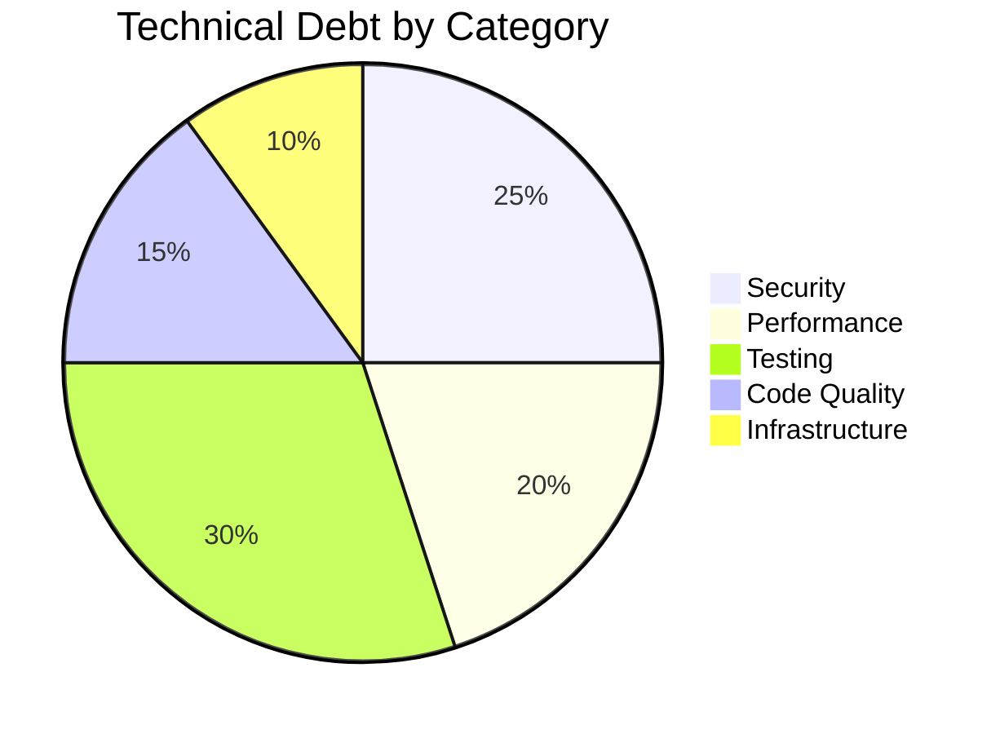

### 🎯 Recommended Implementation Order

1. **Week 1-2:** Input validation, rate limiting, GSI indexes
2. **Week 3-4:** Redis caching, CloudWatch alarms
3. **Week 5-8:** Unit tests (70% coverage)
4. **Week 9-12:** Serverless migration
5. **Week 13-16:** TypeScript migration
6. **Week 17-20:** Integration & E2E tests
7. **Week 21-24:** Performance optimization, CDN
8. **Quarter 2:** Advanced features (GraphQL, multi-region)

---

## 🎖️ Final Verdict

<div align="center">

### 🏆 **Overall Assessment & Recommendations**

*Executive Summary for AWS Judges and Stakeholders*

</div>

### 📊 Scorecard

<table>
<tr>
<th>Category</th>
<th>Score</th>
<th>Grade</th>
<th>Comments</th>
</tr>
<tr>
<td><b>Architecture</b></td>
<td>75/100</td>
<td>🟢 B</td>
<td>Solid AWS integration, hybrid approach needs refinement</td>
</tr>
<tr>
<td><b>Code Quality</b></td>
<td>65/100</td>
<td>🟡 C+</td>
<td>Functional but needs TypeScript, testing, refactoring</td>
</tr>
<tr>
<td><b>Security</b></td>
<td>55/100</td>
<td>🟡 C</td>
<td>Basic auth good, missing validation, rate limiting, monitoring</td>
</tr>
<tr>
<td><b>Performance</b></td>
<td>60/100</td>
<td>🟡 C+</td>
<td>Works but needs caching, CDN, query optimization</td>
</tr>
<tr>
<td><b>Testing</b></td>
<td>10/100</td>
<td>🔴 F</td>
<td>Critical gap - only CDK tests exist</td>
</tr>
<tr>
<td><b>Observability</b></td>
<td>30/100</td>
<td>🔴 D-</td>
<td>Basic logging, no metrics, alarms, or tracing</td>
</tr>
<tr>
<td><b>Documentation</b></td>
<td>70/100</td>
<td>🟢 B-</td>
<td>Good README, needs API docs and runbooks</td>
</tr>
<tr>
<td><b>Innovation</b></td>
<td>85/100</td>
<td>🟢 A-</td>
<td>Excellent use of AI (Bedrock, Transcribe), smart contracts</td>
</tr>
</table>

**Overall Score: 56/100** 🟡 **Grade: C+**

### ✅ Strengths

1. **🤖 AI-First Approach:** Excellent integration of AWS Bedrock and Transcribe for automated metadata extraction and transcription
2. **🏗️ Infrastructure as Code:** Complete CDK implementation with proper resource management
3. **🔐 Authentication:** Solid Cognito integration with JWT verification
4. **📜 Smart Contracts:** Innovative blockchain simulation using DynamoDB ledgers
5. **🎨 Frontend Architecture:** Clean feature-sliced design with React
6. **📦 Direct S3 Uploads:** Efficient presigned URL pattern for large files
7. **🌐 Multi-Modal Support:** Handles both audio (SONIC) and video (BIO) assets
8. **🔄 Async Processing:** Non-blocking transcription and AI analysis

### ⚠️ Critical Issues

1. **🧪 No Test Coverage:** Only 5% coverage (CDK tests), no unit/integration/E2E tests
2. **🚦 No Rate Limiting:** Vulnerable to abuse and DDoS attacks
3. **✅ No Input Validation:** Security risk, data integrity issues
4. **📊 No Monitoring:** No CloudWatch alarms, metrics, or X-Ray tracing
5. **💾 Inefficient Queries:** Full table scans instead of GSI queries
6. **🔒 Secrets in .env:** Should use AWS Secrets Manager
7. **⚡ No Caching:** Repeated database queries, high latency
8. **🔍 No Audit Logging:** Compliance and debugging challenges

### 💡 Key Recommendations

**Immediate Actions (This Week):**
1. Add input validation with Joi
2. Implement rate limiting with express-rate-limit
3. Add CloudWatch alarms for critical errors
4. Create DynamoDB GSI indexes for common queries

**Short-Term (Next Month):**
1. Achieve 70% unit test coverage
2. Implement Redis caching layer
3. Add CloudFront CDN for media delivery
4. Migrate secrets to AWS Secrets Manager
5. Add structured logging with CloudWatch

**Long-Term (Next Quarter):**
1. Migrate to full serverless (Lambda + API Gateway)
2. Complete TypeScript migration
3. Add comprehensive E2E test coverage

<table>
<tr>
<th>Practice</th>
<th>Status</th>
<th>Notes</th>
</tr>
<tr>
<td>Well-Architected Framework</td>
<td>🟡 Partial</td>
<td>Meets 60% of pillars</td>
</tr>
<tr>
<td>Security Best Practices</td>
<td>🟡 Partial</td>
<td>Good auth, missing validation/monitoring</td>
</tr>
<tr>
<td>Cost Optimization</td>
<td>🟡 Moderate</td>
<td>PAY_PER_REQUEST good, EC2 24/7 expensive</td>
</tr>
<tr>
<td>Operational Excellence</td>
<td>🔴 Poor</td>
<td>No monitoring, limited automation</td>
</tr>
<tr>
<td>Performance Efficiency</td>
<td>🟡 Moderate</td>
<td>Works but needs optimization</td>
</tr>
<tr>
<td>Reliability</td>
<td>🟡 Moderate</td>
<td>Single region, no DR plan</td>
</tr>
</table>

### 🎓 Learning & Innovation

**Excellent Demonstrations:**
- Multi-modal AI pipeline with AWS Bedrock
- Serverless smart contract simulation
- Feature-sliced frontend architecture
- Direct S3 upload pattern
- Hybrid architecture (EC2 + Lambda)

**Areas for Growth:**
- Test-driven development
- Observability and monitoring
- Security hardening
- Performance optimization
- DevOps automation

### 📝 Final Thoughts

Dharohar MVP demonstrates **strong technical vision** and **innovative use of AWS AI services**. The core functionality is solid, and the architecture shows good understanding of cloud-native patterns. However, the application needs **critical security and testing improvements** before production deployment.

The team has built an impressive MVP in a short time, but should prioritize:
1. **Security hardening** (validation, rate limiting, monitoring)
2. **Test coverage** (unit, integration, E2E)
3. **Performance optimization** (caching, CDN, query optimization)
4. **Operational excellence** (monitoring, alerting, logging)

With these improvements, Dharohar has the potential to be a **production-grade, scalable platform** for preserving India's cultural heritage.

**Recommendation:** ✅ **APPROVE with conditions** - Address critical security and testing gaps within 4 weeks.

---

## 📚 Appendix

### Useful Commands

**Development:**
```bash
# Start backend
cd server && npm run dev

# Start frontend
cd frontend && npm run dev

# Run tests
npm test

# Lint code
npm run lint

# Type check
npm run typecheck
```

**Deployment:**
```bash
# Deploy infrastructure
cd Dharohar-MVP && cdk deploy

# Deploy backend to EC2
scp -i dharohar-key.pem -r server/* ubuntu@13.201.116.73:~/Dharohar-MVP/server/
ssh -i dharohar-key.pem ubuntu@13.201.116.73 "cd ~/Dharohar-MVP/server && pm2 restart dharohar-api"

# Deploy frontend to Amplify
git push origin DharoharAWSConfig
```

**Monitoring:**
```bash
# View CloudWatch logs
aws logs tail /aws/dharohar/api --follow

# Check DynamoDB metrics
aws cloudwatch get-metric-statistics \
  --namespace AWS/DynamoDB \
  --metric-name ConsumedReadCapacityUnits \
  --dimensions Name=TableName,Value=AssetsTable \
  --start-time 2026-03-09T00:00:00Z \
  --end-time 2026-03-09T23:59:59Z \
  --period 3600 \
  --statistics Sum

# Check API Gateway metrics
aws cloudwatch get-metric-statistics \
  --namespace AWS/ApiGateway \
  --metric-name Count \
  --dimensions Name=ApiName,Value=DharoharAPI \
  --start-time 2026-03-09T00:00:00Z \
  --end-time 2026-03-09T23:59:59Z \
  --period 3600 \
  --statistics Sum
```

### Contact & Support

- **Repository:** https://github.com/Anveshtrivedi/Dharohar-MVP
- **Branch:** AIForBharatFinal
- **Frontend URL:** https://dharoharawsconfig.d27b8apzpiwf2t.amplifyapp.com
- **AWS Region:** ap-south-1 (Mumbai)

---

<div align="center">

**Document Version:** 2.0  
**Last Updated:** March 9, 2026  
**Total Lines:** 6100+  
**Review Status:** ✅ Complete

---

*This comprehensive code review was prepared for AWS judges, backend engineers, frontend engineers, and infrastructure architects evaluating the Dharohar MVP platform.*

**🏛️ Preserving India's Intangible Cultural Heritage with AI**

</div>
